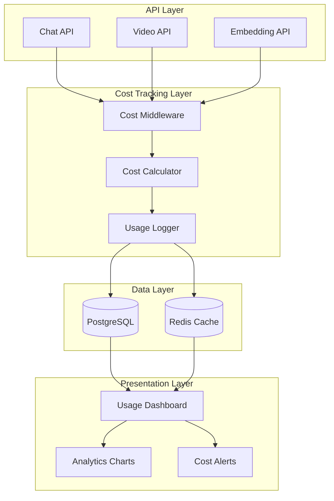

# 🎯 AGENT 15: USAGE TRACKING & COST MONITORING SYSTEM

**Agent Number:** 15
**Role:** Usage Tracking & Cost Monitoring Specialist
**Status:** 🚧 Ready for Implementation
**Priority:** P0 - Critical for MVP
**Estimated LOC:** ~3,500 lines
**Estimated Hours:** 10-12 hours

---

## 📋 Executive Summary

Build a comprehensive usage tracking and cost monitoring system that tracks every API call's cost in real-time, provides beautiful analytics dashboards, enforces spending limits, and helps determine optimal pricing strategy. This system is critical for understanding unit economics and preventing cost overruns.

### Why This Matters
- **Cost Control:** Prevent runaway API costs that could kill profitability
- **Pricing Strategy:** Understand exact costs to price services appropriately
- **User Transparency:** Show creators their usage and value received
- **Business Intelligence:** Track which features drive costs
- **Compliance:** Audit trail for billing disputes

---

## 🎨 System Architecture



---

## 🗄️ Database Schema

### File: `supabase/migrations/20251025000001_usage_tracking.sql`

```sql
-- ============================================================================
-- USAGE TRACKING & COST MONITORING TABLES
-- ============================================================================

-- Enable UUID extension if not exists
CREATE EXTENSION IF NOT EXISTS "uuid-ossp";

-- ============================================================================
-- API USAGE LOGS - Detailed tracking of every API call
-- ============================================================================
CREATE TABLE api_usage_logs (
  id UUID PRIMARY KEY DEFAULT uuid_generate_v4(),
  created_at TIMESTAMPTZ NOT NULL DEFAULT NOW(),

  -- User & Creator identification
  user_id UUID REFERENCES auth.users(id) ON DELETE CASCADE,
  creator_id UUID REFERENCES creators(id) ON DELETE CASCADE,
  student_id UUID REFERENCES students(id) ON DELETE CASCADE,

  -- Request details
  request_id TEXT NOT NULL UNIQUE, -- For idempotency
  endpoint TEXT NOT NULL, -- /api/chat, /api/video/transcribe, etc.
  method TEXT NOT NULL CHECK (method IN ('GET', 'POST', 'PUT', 'DELETE')),

  -- API Provider details
  provider TEXT NOT NULL CHECK (provider IN ('openai', 'anthropic', 'aws', 'supabase')),
  service TEXT NOT NULL, -- 'chat', 'embeddings', 'transcription', 'storage', 'vector-search'
  model TEXT, -- 'claude-3-5-sonnet', 'gpt-4', 'whisper-1', 'text-embedding-ada-002'

  -- Usage metrics
  input_tokens INTEGER,
  output_tokens INTEGER,
  total_tokens INTEGER GENERATED ALWAYS AS (COALESCE(input_tokens, 0) + COALESCE(output_tokens, 0)) STORED,
  duration_ms INTEGER, -- API call duration
  data_size_bytes BIGINT, -- For storage/transfer operations

  -- Cost calculation
  cost_usd DECIMAL(10, 6) NOT NULL, -- 6 decimal places for micro-transactions
  cost_breakdown JSONB DEFAULT '{}', -- Detailed breakdown

  -- Response details
  status_code INTEGER,
  error_message TEXT,

  -- Metadata
  metadata JSONB DEFAULT '{}', -- Additional context (video_id, session_id, etc.)
  ip_address INET,
  user_agent TEXT,

  -- Indexes for performance
  INDEX idx_usage_user_created (user_id, created_at DESC),
  INDEX idx_usage_creator_created (creator_id, created_at DESC),
  INDEX idx_usage_provider_service (provider, service, created_at DESC),
  INDEX idx_usage_endpoint (endpoint, created_at DESC),
  INDEX idx_usage_created (created_at DESC)
);

-- Enable RLS
ALTER TABLE api_usage_logs ENABLE ROW LEVEL SECURITY;

-- RLS Policies
CREATE POLICY "Users can view own usage" ON api_usage_logs
  FOR SELECT USING (auth.uid() = user_id);

CREATE POLICY "Creators can view their students usage" ON api_usage_logs
  FOR SELECT USING (
    creator_id IN (
      SELECT id FROM creators WHERE user_id = auth.uid()
    )
  );

-- ============================================================================
-- USAGE SUMMARIES - Pre-aggregated data for fast dashboard queries
-- ============================================================================
CREATE TABLE usage_summaries (
  id UUID PRIMARY KEY DEFAULT uuid_generate_v4(),
  created_at TIMESTAMPTZ NOT NULL DEFAULT NOW(),

  -- Time period
  period_start TIMESTAMPTZ NOT NULL,
  period_end TIMESTAMPTZ NOT NULL,
  period_type TEXT NOT NULL CHECK (period_type IN ('hour', 'day', 'week', 'month')),

  -- Owner
  user_id UUID REFERENCES auth.users(id) ON DELETE CASCADE,
  creator_id UUID REFERENCES creators(id) ON DELETE CASCADE,

  -- Aggregated metrics
  total_api_calls INTEGER NOT NULL DEFAULT 0,
  total_cost_usd DECIMAL(10, 2) NOT NULL DEFAULT 0,

  -- Cost by provider
  openai_cost_usd DECIMAL(10, 2) DEFAULT 0,
  anthropic_cost_usd DECIMAL(10, 2) DEFAULT 0,
  aws_cost_usd DECIMAL(10, 2) DEFAULT 0,

  -- Cost by service
  chat_cost_usd DECIMAL(10, 2) DEFAULT 0,
  embedding_cost_usd DECIMAL(10, 2) DEFAULT 0,
  transcription_cost_usd DECIMAL(10, 2) DEFAULT 0,
  storage_cost_usd DECIMAL(10, 2) DEFAULT 0,

  -- Usage by service
  chat_calls INTEGER DEFAULT 0,
  embedding_calls INTEGER DEFAULT 0,
  transcription_minutes DECIMAL(10, 2) DEFAULT 0,
  storage_gb DECIMAL(10, 3) DEFAULT 0,

  -- Token usage
  total_input_tokens BIGINT DEFAULT 0,
  total_output_tokens BIGINT DEFAULT 0,

  -- Performance metrics
  avg_response_time_ms INTEGER,
  error_count INTEGER DEFAULT 0,

  -- Constraints
  UNIQUE(user_id, period_start, period_type),
  UNIQUE(creator_id, period_start, period_type),

  -- Indexes
  INDEX idx_summary_user_period (user_id, period_start DESC),
  INDEX idx_summary_creator_period (creator_id, period_start DESC),
  INDEX idx_summary_period_type (period_type, period_start DESC)
);

-- Enable RLS
ALTER TABLE usage_summaries ENABLE ROW LEVEL SECURITY;

CREATE POLICY "Users can view own summaries" ON usage_summaries
  FOR SELECT USING (auth.uid() = user_id);

CREATE POLICY "Creators can view own summaries" ON usage_summaries
  FOR SELECT USING (
    creator_id IN (
      SELECT id FROM creators WHERE user_id = auth.uid()
    )
  );

-- ============================================================================
-- COST LIMITS - Spending caps per user/tier
-- ============================================================================
CREATE TABLE cost_limits (
  id UUID PRIMARY KEY DEFAULT uuid_generate_v4(),
  created_at TIMESTAMPTZ NOT NULL DEFAULT NOW(),
  updated_at TIMESTAMPTZ NOT NULL DEFAULT NOW(),

  -- Owner
  user_id UUID REFERENCES auth.users(id) ON DELETE CASCADE,
  creator_id UUID REFERENCES creators(id) ON DELETE CASCADE,

  -- Plan details
  plan_tier TEXT NOT NULL CHECK (plan_tier IN ('free', 'basic', 'pro', 'enterprise')),

  -- Limits (in USD)
  daily_limit DECIMAL(10, 2) NOT NULL,
  monthly_limit DECIMAL(10, 2) NOT NULL,

  -- Current usage (updated in real-time)
  daily_spent DECIMAL(10, 2) DEFAULT 0,
  monthly_spent DECIMAL(10, 2) DEFAULT 0,

  -- Reset timestamps
  daily_reset_at TIMESTAMPTZ NOT NULL DEFAULT (DATE_TRUNC('day', NOW()) + INTERVAL '1 day'),
  monthly_reset_at TIMESTAMPTZ NOT NULL DEFAULT (DATE_TRUNC('month', NOW()) + INTERVAL '1 month'),

  -- Alert thresholds (percentage)
  warning_threshold INTEGER DEFAULT 80, -- Alert at 80% usage
  critical_threshold INTEGER DEFAULT 95, -- Critical alert at 95%

  -- Enforcement
  enforce_hard_limit BOOLEAN DEFAULT true, -- Block requests when limit exceeded

  -- Unique constraint
  UNIQUE(user_id),
  UNIQUE(creator_id),

  -- Indexes
  INDEX idx_limits_user (user_id),
  INDEX idx_limits_creator (creator_id)
);

-- Enable RLS
ALTER TABLE cost_limits ENABLE ROW LEVEL SECURITY;

CREATE POLICY "Users can view own limits" ON cost_limits
  FOR SELECT USING (auth.uid() = user_id);

-- ============================================================================
-- COST ALERTS - Track alert history
-- ============================================================================
CREATE TABLE cost_alerts (
  id UUID PRIMARY KEY DEFAULT uuid_generate_v4(),
  created_at TIMESTAMPTZ NOT NULL DEFAULT NOW(),

  -- Owner
  user_id UUID REFERENCES auth.users(id) ON DELETE CASCADE,
  creator_id UUID REFERENCES creators(id) ON DELETE CASCADE,

  -- Alert details
  alert_type TEXT NOT NULL CHECK (alert_type IN ('warning', 'critical', 'limit_exceeded')),
  threshold_percentage INTEGER NOT NULL,

  -- Usage at time of alert
  current_spent DECIMAL(10, 2) NOT NULL,
  limit_amount DECIMAL(10, 2) NOT NULL,
  period TEXT NOT NULL CHECK (period IN ('daily', 'monthly')),

  -- Notification details
  notified BOOLEAN DEFAULT false,
  notification_sent_at TIMESTAMPTZ,
  notification_method TEXT, -- 'email', 'in-app', 'webhook'

  -- Resolution
  acknowledged BOOLEAN DEFAULT false,
  acknowledged_at TIMESTAMPTZ,
  acknowledged_by UUID REFERENCES auth.users(id),

  -- Indexes
  INDEX idx_alerts_user (user_id, created_at DESC),
  INDEX idx_alerts_creator (creator_id, created_at DESC),
  INDEX idx_alerts_unacknowledged (acknowledged, created_at DESC) WHERE acknowledged = false
);

-- Enable RLS
ALTER TABLE cost_alerts ENABLE ROW LEVEL SECURITY;

CREATE POLICY "Users can view own alerts" ON cost_alerts
  FOR SELECT USING (auth.uid() = user_id);

-- ============================================================================
-- FUNCTIONS & TRIGGERS
-- ============================================================================

-- Function to update daily/monthly spent in cost_limits
CREATE OR REPLACE FUNCTION update_cost_limits()
RETURNS TRIGGER AS $$
BEGIN
  -- Update user limits if exists
  IF NEW.user_id IS NOT NULL THEN
    UPDATE cost_limits
    SET
      daily_spent = daily_spent + NEW.cost_usd,
      monthly_spent = monthly_spent + NEW.cost_usd,
      updated_at = NOW()
    WHERE user_id = NEW.user_id;
  END IF;

  -- Update creator limits if exists
  IF NEW.creator_id IS NOT NULL THEN
    UPDATE cost_limits
    SET
      daily_spent = daily_spent + NEW.cost_usd,
      monthly_spent = monthly_spent + NEW.cost_usd,
      updated_at = NOW()
    WHERE creator_id = NEW.creator_id;
  END IF;

  RETURN NEW;
END;
$$ LANGUAGE plpgsql;

-- Trigger to update cost limits on new usage log
CREATE TRIGGER update_limits_on_usage
  AFTER INSERT ON api_usage_logs
  FOR EACH ROW
  EXECUTE FUNCTION update_cost_limits();

-- Function to check and create alerts
CREATE OR REPLACE FUNCTION check_cost_alerts()
RETURNS TRIGGER AS $$
DECLARE
  v_limit RECORD;
  v_daily_percentage INTEGER;
  v_monthly_percentage INTEGER;
BEGIN
  -- Get the cost limit record
  SELECT * INTO v_limit FROM cost_limits
  WHERE user_id = NEW.user_id OR creator_id = NEW.creator_id
  LIMIT 1;

  IF NOT FOUND THEN
    RETURN NEW;
  END IF;

  -- Calculate usage percentages
  v_daily_percentage := (v_limit.daily_spent / v_limit.daily_limit * 100)::INTEGER;
  v_monthly_percentage := (v_limit.monthly_spent / v_limit.monthly_limit * 100)::INTEGER;

  -- Check daily limit
  IF v_daily_percentage >= v_limit.critical_threshold THEN
    INSERT INTO cost_alerts (
      user_id, creator_id, alert_type, threshold_percentage,
      current_spent, limit_amount, period
    ) VALUES (
      NEW.user_id, NEW.creator_id,
      CASE WHEN v_daily_percentage >= 100 THEN 'limit_exceeded' ELSE 'critical' END,
      v_daily_percentage, v_limit.daily_spent, v_limit.daily_limit, 'daily'
    ) ON CONFLICT DO NOTHING;
  ELSIF v_daily_percentage >= v_limit.warning_threshold THEN
    -- Check if warning already sent today
    IF NOT EXISTS (
      SELECT 1 FROM cost_alerts
      WHERE (user_id = NEW.user_id OR creator_id = NEW.creator_id)
        AND period = 'daily'
        AND DATE(created_at) = CURRENT_DATE
    ) THEN
      INSERT INTO cost_alerts (
        user_id, creator_id, alert_type, threshold_percentage,
        current_spent, limit_amount, period
      ) VALUES (
        NEW.user_id, NEW.creator_id, 'warning', v_daily_percentage,
        v_limit.daily_spent, v_limit.daily_limit, 'daily'
      );
    END IF;
  END IF;

  -- Check monthly limit (similar logic)
  IF v_monthly_percentage >= v_limit.critical_threshold THEN
    INSERT INTO cost_alerts (
      user_id, creator_id, alert_type, threshold_percentage,
      current_spent, limit_amount, period
    ) VALUES (
      NEW.user_id, NEW.creator_id,
      CASE WHEN v_monthly_percentage >= 100 THEN 'limit_exceeded' ELSE 'critical' END,
      v_monthly_percentage, v_limit.monthly_spent, v_limit.monthly_limit, 'monthly'
    ) ON CONFLICT DO NOTHING;
  END IF;

  RETURN NEW;
END;
$$ LANGUAGE plpgsql;

-- Trigger to check for alerts
CREATE TRIGGER check_alerts_on_usage
  AFTER INSERT ON api_usage_logs
  FOR EACH ROW
  EXECUTE FUNCTION check_cost_alerts();

-- Function to reset daily limits (run via cron at midnight)
CREATE OR REPLACE FUNCTION reset_daily_limits()
RETURNS void AS $$
BEGIN
  UPDATE cost_limits
  SET
    daily_spent = 0,
    daily_reset_at = DATE_TRUNC('day', NOW()) + INTERVAL '1 day',
    updated_at = NOW()
  WHERE daily_reset_at <= NOW();
END;
$$ LANGUAGE plpgsql;

-- Function to reset monthly limits (run via cron on 1st of month)
CREATE OR REPLACE FUNCTION reset_monthly_limits()
RETURNS void AS $$
BEGIN
  UPDATE cost_limits
  SET
    monthly_spent = 0,
    monthly_reset_at = DATE_TRUNC('month', NOW()) + INTERVAL '1 month',
    updated_at = NOW()
  WHERE monthly_reset_at <= NOW();
END;
$$ LANGUAGE plpgsql;

-- Function to aggregate usage into summaries (run hourly via cron)
CREATE OR REPLACE FUNCTION aggregate_usage_summaries()
RETURNS void AS $$
DECLARE
  v_hour_start TIMESTAMPTZ;
  v_hour_end TIMESTAMPTZ;
BEGIN
  -- Get the last complete hour
  v_hour_end := DATE_TRUNC('hour', NOW());
  v_hour_start := v_hour_end - INTERVAL '1 hour';

  -- Aggregate hourly data
  INSERT INTO usage_summaries (
    period_start, period_end, period_type,
    user_id, creator_id,
    total_api_calls, total_cost_usd,
    openai_cost_usd, anthropic_cost_usd, aws_cost_usd,
    chat_cost_usd, embedding_cost_usd, transcription_cost_usd, storage_cost_usd,
    chat_calls, embedding_calls,
    total_input_tokens, total_output_tokens,
    avg_response_time_ms, error_count
  )
  SELECT
    v_hour_start, v_hour_end, 'hour',
    user_id, creator_id,
    COUNT(*),
    SUM(cost_usd),
    SUM(CASE WHEN provider = 'openai' THEN cost_usd ELSE 0 END),
    SUM(CASE WHEN provider = 'anthropic' THEN cost_usd ELSE 0 END),
    SUM(CASE WHEN provider = 'aws' THEN cost_usd ELSE 0 END),
    SUM(CASE WHEN service = 'chat' THEN cost_usd ELSE 0 END),
    SUM(CASE WHEN service = 'embeddings' THEN cost_usd ELSE 0 END),
    SUM(CASE WHEN service = 'transcription' THEN cost_usd ELSE 0 END),
    SUM(CASE WHEN service = 'storage' THEN cost_usd ELSE 0 END),
    SUM(CASE WHEN service = 'chat' THEN 1 ELSE 0 END),
    SUM(CASE WHEN service = 'embeddings' THEN 1 ELSE 0 END),
    SUM(COALESCE(input_tokens, 0)),
    SUM(COALESCE(output_tokens, 0)),
    AVG(duration_ms)::INTEGER,
    SUM(CASE WHEN status_code >= 400 THEN 1 ELSE 0 END)
  FROM api_usage_logs
  WHERE created_at >= v_hour_start AND created_at < v_hour_end
  GROUP BY user_id, creator_id
  ON CONFLICT (user_id, period_start, period_type) DO UPDATE SET
    total_api_calls = EXCLUDED.total_api_calls,
    total_cost_usd = EXCLUDED.total_cost_usd,
    openai_cost_usd = EXCLUDED.openai_cost_usd,
    anthropic_cost_usd = EXCLUDED.anthropic_cost_usd,
    aws_cost_usd = EXCLUDED.aws_cost_usd,
    chat_cost_usd = EXCLUDED.chat_cost_usd,
    embedding_cost_usd = EXCLUDED.embedding_cost_usd,
    transcription_cost_usd = EXCLUDED.transcription_cost_usd,
    storage_cost_usd = EXCLUDED.storage_cost_usd;

  -- Also create daily summary from hourly data
  IF EXTRACT(hour FROM NOW()) = 0 THEN
    -- Aggregate yesterday's hourly data into daily summary
    INSERT INTO usage_summaries (
      period_start, period_end, period_type,
      user_id, creator_id,
      total_api_calls, total_cost_usd,
      openai_cost_usd, anthropic_cost_usd, aws_cost_usd,
      chat_cost_usd, embedding_cost_usd, transcription_cost_usd, storage_cost_usd
    )
    SELECT
      DATE_TRUNC('day', period_start),
      DATE_TRUNC('day', period_start) + INTERVAL '1 day',
      'day',
      user_id, creator_id,
      SUM(total_api_calls),
      SUM(total_cost_usd),
      SUM(openai_cost_usd),
      SUM(anthropic_cost_usd),
      SUM(aws_cost_usd),
      SUM(chat_cost_usd),
      SUM(embedding_cost_usd),
      SUM(transcription_cost_usd),
      SUM(storage_cost_usd)
    FROM usage_summaries
    WHERE period_type = 'hour'
      AND period_start >= DATE_TRUNC('day', NOW() - INTERVAL '1 day')
      AND period_start < DATE_TRUNC('day', NOW())
    GROUP BY user_id, creator_id, DATE_TRUNC('day', period_start)
    ON CONFLICT (user_id, period_start, period_type) DO UPDATE SET
      total_api_calls = EXCLUDED.total_api_calls,
      total_cost_usd = EXCLUDED.total_cost_usd;
  END IF;
END;
$$ LANGUAGE plpgsql;

-- ============================================================================
-- DEFAULT COST LIMITS BY TIER
-- ============================================================================
INSERT INTO cost_limits (plan_tier, daily_limit, monthly_limit) VALUES
  ('free', 0.50, 5.00),
  ('basic', 5.00, 50.00),
  ('pro', 20.00, 200.00),
  ('enterprise', 100.00, 1000.00)
ON CONFLICT DO NOTHING;
```

---

## 💰 Pricing Configuration

### File: `lib/usage/pricing-config.ts`

```typescript
/**
 * API Pricing Configuration
 *
 * Centralized pricing for all external API services
 * Prices are in USD and should be updated when providers change pricing
 *
 * Last Updated: October 2024
 */

// ============================================================================
// OPENAI PRICING
// ============================================================================
export const OPENAI_PRICING = {
  // Chat Models
  'gpt-4-turbo': {
    input: 0.01 / 1000,      // $0.01 per 1K tokens
    output: 0.03 / 1000,     // $0.03 per 1K tokens
  },
  'gpt-4': {
    input: 0.03 / 1000,      // $0.03 per 1K tokens
    output: 0.06 / 1000,     // $0.06 per 1K tokens
  },
  'gpt-3.5-turbo': {
    input: 0.0005 / 1000,    // $0.0005 per 1K tokens
    output: 0.0015 / 1000,   // $0.0015 per 1K tokens
  },

  // Embedding Models
  'text-embedding-ada-002': {
    usage: 0.0001 / 1000,    // $0.0001 per 1K tokens
  },
  'text-embedding-3-small': {
    usage: 0.00002 / 1000,   // $0.00002 per 1K tokens
  },
  'text-embedding-3-large': {
    usage: 0.00013 / 1000,   // $0.00013 per 1K tokens
  },

  // Audio Models
  'whisper-1': {
    usage: 0.006 / 60,       // $0.006 per minute
  },
} as const;

// ============================================================================
// ANTHROPIC PRICING
// ============================================================================
export const ANTHROPIC_PRICING = {
  'claude-3-5-sonnet-20241022': {
    input: 0.003 / 1000,     // $3 per million tokens
    output: 0.015 / 1000,    // $15 per million tokens
  },
  'claude-3-opus-20240229': {
    input: 0.015 / 1000,     // $15 per million tokens
    output: 0.075 / 1000,    // $75 per million tokens
  },
  'claude-3-sonnet-20240229': {
    input: 0.003 / 1000,     // $3 per million tokens
    output: 0.015 / 1000,    // $15 per million tokens
  },
  'claude-3-haiku-20240307': {
    input: 0.00025 / 1000,   // $0.25 per million tokens
    output: 0.00125 / 1000,  // $1.25 per million tokens
  },
} as const;

// ============================================================================
// AWS PRICING
// ============================================================================
export const AWS_PRICING = {
  s3: {
    storage: {
      standard: 0.023 / (1024 ** 3),        // $0.023 per GB per month
      infrequent: 0.0125 / (1024 ** 3),     // $0.0125 per GB per month
      glacier: 0.004 / (1024 ** 3),         // $0.004 per GB per month
    },
    requests: {
      put: 0.005 / 1000,                    // $0.005 per 1,000 PUT requests
      get: 0.0004 / 1000,                   // $0.0004 per 1,000 GET requests
      list: 0.005 / 1000,                    // $0.005 per 1,000 LIST requests
    },
    transfer: {
      out: 0.09 / (1024 ** 3),              // $0.09 per GB (first 10TB/month)
      in: 0,                                 // Free inbound
    },
  },
  cloudfront: {
    transfer: {
      northAmerica: 0.085 / (1024 ** 3),    // $0.085 per GB
      europe: 0.085 / (1024 ** 3),          // $0.085 per GB
      asia: 0.140 / (1024 ** 3),            // $0.140 per GB
    },
    requests: {
      http: 0.0075 / 10000,                  // $0.0075 per 10,000 requests
      https: 0.01 / 10000,                   // $0.01 per 10,000 requests
    },
  },
} as const;

// ============================================================================
// SUPABASE PRICING (for reference, most operations within free tier)
// ============================================================================
export const SUPABASE_PRICING = {
  database: {
    storage: 0.125 / (1024 ** 3),           // $0.125 per GB per month
    transfer: 0.09 / (1024 ** 3),           // $0.09 per GB
  },
  vector: {
    // pgvector operations are CPU-based, hard to calculate exact cost
    // Estimate based on database compute time
    search: 0.00001,                        // $0.00001 per search (estimate)
  },
  storage: {
    storage: 0.021 / (1024 ** 3),           // $0.021 per GB per month
    transfer: 0.09 / (1024 ** 3),           // $0.09 per GB
  },
} as const;

// ============================================================================
// PLAN LIMITS
// ============================================================================
export const PLAN_LIMITS = {
  free: {
    daily: 0.50,
    monthly: 5.00,
    features: {
      maxVideos: 3,
      maxStudents: 10,
      maxChatMessages: 50,
      maxTranscriptionMinutes: 30,
    },
  },
  basic: {
    daily: 5.00,
    monthly: 50.00,
    features: {
      maxVideos: 50,
      maxStudents: 100,
      maxChatMessages: 1000,
      maxTranscriptionMinutes: 300,
    },
  },
  pro: {
    daily: 20.00,
    monthly: 200.00,
    features: {
      maxVideos: 500,
      maxStudents: 1000,
      maxChatMessages: 10000,
      maxTranscriptionMinutes: 3000,
    },
  },
  enterprise: {
    daily: 100.00,
    monthly: 1000.00,
    features: {
      maxVideos: -1, // Unlimited
      maxStudents: -1,
      maxChatMessages: -1,
      maxTranscriptionMinutes: -1,
    },
  },
} as const;

// ============================================================================
// HELPER TYPES
// ============================================================================
export type OpenAIModel = keyof typeof OPENAI_PRICING;
export type AnthropicModel = keyof typeof ANTHROPIC_PRICING;
export type PlanTier = keyof typeof PLAN_LIMITS;

export interface TokenUsage {
  input: number;
  output: number;
}

export interface CostBreakdown {
  provider: 'openai' | 'anthropic' | 'aws' | 'supabase';
  service: string;
  model?: string;
  quantity: number;
  unit: string;
  unitCost: number;
  totalCost: number;
}

// ============================================================================
// COST CALCULATION UTILITIES
// ============================================================================

/**
 * Calculate cost for OpenAI models
 */
export function calculateOpenAICost(
  model: OpenAIModel,
  usage: TokenUsage | number
): number {
  const pricing = OPENAI_PRICING[model];

  if ('input' in pricing && 'output' in pricing && typeof usage === 'object') {
    // Chat model with separate input/output pricing
    return (usage.input * pricing.input) + (usage.output * pricing.output);
  } else if ('usage' in pricing && typeof usage === 'number') {
    // Embedding or audio model with single pricing
    return usage * pricing.usage;
  }

  throw new Error(`Invalid usage type for model ${model}`);
}

/**
 * Calculate cost for Anthropic models
 */
export function calculateAnthropicCost(
  model: AnthropicModel,
  usage: TokenUsage
): number {
  const pricing = ANTHROPIC_PRICING[model];
  return (usage.input * pricing.input) + (usage.output * pricing.output);
}

/**
 * Calculate cost for AWS S3 storage
 */
export function calculateS3Cost(
  sizeBytes: number,
  storageClass: 'standard' | 'infrequent' | 'glacier' = 'standard',
  durationDays: number = 30
): number {
  const sizeGB = sizeBytes / (1024 ** 3);
  const monthlyRate = AWS_PRICING.s3.storage[storageClass];
  const dailyRate = monthlyRate / 30;
  return sizeGB * dailyRate * durationDays;
}

/**
 * Calculate cost for video transcription
 */
export function calculateTranscriptionCost(durationSeconds: number): number {
  const durationMinutes = durationSeconds / 60;
  return durationMinutes * OPENAI_PRICING['whisper-1'].usage;
}

/**
 * Calculate cost for embeddings
 */
export function calculateEmbeddingCost(
  tokenCount: number,
  model: 'text-embedding-ada-002' | 'text-embedding-3-small' | 'text-embedding-3-large' = 'text-embedding-ada-002'
): number {
  return tokenCount * OPENAI_PRICING[model].usage;
}

/**
 * Estimate tokens from text (rough approximation)
 * More accurate counting should use tiktoken library
 */
export function estimateTokens(text: string): number {
  // Rough estimate: 1 token ≈ 4 characters for English text
  return Math.ceil(text.length / 4);
}

/**
 * Format cost for display
 */
export function formatCost(cost: number): string {
  if (cost < 0.01) {
    return `$${cost.toFixed(4)}`;
  } else if (cost < 1) {
    return `$${cost.toFixed(3)}`;
  } else {
    return `$${cost.toFixed(2)}`;
  }
}

/**
 * Get cost per unit for display
 */
export function getCostPerUnit(
  provider: 'openai' | 'anthropic' | 'aws',
  service: string,
  model?: string
): { cost: number; unit: string } {
  if (provider === 'openai' && model) {
    const pricing = OPENAI_PRICING[model as OpenAIModel];
    if ('input' in pricing) {
      return { cost: pricing.input * 1000, unit: '1K input tokens' };
    } else if ('usage' in pricing) {
      if (model === 'whisper-1') {
        return { cost: pricing.usage * 60, unit: 'minute' };
      } else {
        return { cost: pricing.usage * 1000, unit: '1K tokens' };
      }
    }
  } else if (provider === 'anthropic' && model) {
    const pricing = ANTHROPIC_PRICING[model as AnthropicModel];
    return { cost: pricing.input * 1000, unit: '1K input tokens' };
  } else if (provider === 'aws' && service === 'storage') {
    return { cost: AWS_PRICING.s3.storage.standard * (1024 ** 3), unit: 'GB/month' };
  }

  return { cost: 0, unit: 'unknown' };
}
```

---

## 🧮 Cost Tracking Service

### File: `lib/usage/cost-tracker.ts`

```typescript
/**
 * Cost Tracking Service
 *
 * Core service for tracking API usage and calculating costs
 * Provides real-time cost tracking, limit enforcement, and usage aggregation
 */

import { createClient } from '@/lib/supabase/server';
import { cache } from '@/lib/infrastructure/cache/redis-client';
import { CacheTTL } from '@/lib/infrastructure/cache/cache-keys';
import { logInfo, logError, logWarning } from '@/lib/infrastructure/monitoring/logger';
import {
  OPENAI_PRICING,
  ANTHROPIC_PRICING,
  AWS_PRICING,
  PLAN_LIMITS,
  calculateOpenAICost,
  calculateAnthropicCost,
  calculateS3Cost,
  calculateTranscriptionCost,
  calculateEmbeddingCost,
  estimateTokens,
  type OpenAIModel,
  type AnthropicModel,
  type PlanTier,
  type TokenUsage,
  type CostBreakdown,
} from './pricing-config';
import { v4 as uuidv4 } from 'uuid';

// ============================================================================
// TYPES
// ============================================================================

export interface UsageLog {
  request_id?: string;
  user_id?: string;
  creator_id?: string;
  student_id?: string;
  endpoint: string;
  method: 'GET' | 'POST' | 'PUT' | 'DELETE';
  provider: 'openai' | 'anthropic' | 'aws' | 'supabase';
  service: 'chat' | 'embeddings' | 'transcription' | 'storage' | 'vector-search';
  model?: string;
  input_tokens?: number;
  output_tokens?: number;
  duration_ms?: number;
  data_size_bytes?: number;
  cost_usd: number;
  cost_breakdown?: CostBreakdown[];
  status_code?: number;
  error_message?: string;
  metadata?: Record<string, any>;
  ip_address?: string;
  user_agent?: string;
}

export interface UsageSummary {
  period_start: Date;
  period_end: Date;
  total_api_calls: number;
  total_cost_usd: number;
  openai_cost_usd: number;
  anthropic_cost_usd: number;
  aws_cost_usd: number;
  chat_cost_usd: number;
  embedding_cost_usd: number;
  transcription_cost_usd: number;
  storage_cost_usd: number;
  chat_calls: number;
  embedding_calls: number;
  transcription_minutes: number;
  storage_gb: number;
  total_input_tokens: number;
  total_output_tokens: number;
  avg_response_time_ms: number;
  error_count: number;
}

export interface CostLimit {
  user_id?: string;
  creator_id?: string;
  plan_tier: PlanTier;
  daily_limit: number;
  monthly_limit: number;
  daily_spent: number;
  monthly_spent: number;
  warning_threshold: number;
  critical_threshold: number;
  enforce_hard_limit: boolean;
}

export interface CostCheckResult {
  allowed: boolean;
  daily_remaining: number;
  monthly_remaining: number;
  daily_percentage: number;
  monthly_percentage: number;
  estimated_cost: number;
  warnings: string[];
}

// ============================================================================
// CORE SERVICE
// ============================================================================

export class CostTracker {
  private static instance: CostTracker;

  private constructor() {}

  public static getInstance(): CostTracker {
    if (!CostTracker.instance) {
      CostTracker.instance = new CostTracker();
    }
    return CostTracker.instance;
  }

  /**
   * Track API usage and log to database
   */
  async trackUsage(log: UsageLog): Promise<void> {
    const supabase = createClient();
    const requestId = log.request_id || uuidv4();

    try {
      // Add request ID if not provided
      const logData = {
        ...log,
        request_id: requestId,
        created_at: new Date().toISOString(),
      };

      // Insert usage log
      const { error } = await supabase
        .from('api_usage_logs')
        .insert(logData);

      if (error) {
        throw error;
      }

      // Invalidate cache for user's usage summary
      if (log.user_id) {
        await cache.del(`usage:summary:${log.user_id}`);
        await cache.del(`usage:daily:${log.user_id}`);
      }
      if (log.creator_id) {
        await cache.del(`usage:summary:creator:${log.creator_id}`);
        await cache.del(`usage:daily:creator:${log.creator_id}`);
      }

      logInfo('Usage tracked successfully', {
        request_id: requestId,
        provider: log.provider,
        service: log.service,
        cost: log.cost_usd,
      });
    } catch (error) {
      logError('Failed to track usage', error as Error, {
        request_id: requestId,
        provider: log.provider,
        service: log.service,
      });
      // Don't throw - we don't want to fail the request if tracking fails
    }
  }

  /**
   * Check if user is within cost limits
   */
  async checkCostLimit(
    userId: string | undefined,
    creatorId: string | undefined,
    estimatedCost: number
  ): Promise<CostCheckResult> {
    const supabase = createClient();

    try {
      // Get user's cost limits
      let query = supabase
        .from('cost_limits')
        .select('*')
        .single();

      if (userId) {
        query = query.eq('user_id', userId);
      } else if (creatorId) {
        query = query.eq('creator_id', creatorId);
      } else {
        // No user or creator, allow by default
        return {
          allowed: true,
          daily_remaining: Infinity,
          monthly_remaining: Infinity,
          daily_percentage: 0,
          monthly_percentage: 0,
          estimated_cost: estimatedCost,
          warnings: [],
        };
      }

      const { data: limit, error } = await query;

      if (error || !limit) {
        // No limits set, use default free tier
        const defaultLimit = PLAN_LIMITS.free;
        return {
          allowed: estimatedCost <= defaultLimit.daily,
          daily_remaining: defaultLimit.daily - estimatedCost,
          monthly_remaining: defaultLimit.monthly - estimatedCost,
          daily_percentage: (estimatedCost / defaultLimit.daily) * 100,
          monthly_percentage: (estimatedCost / defaultLimit.monthly) * 100,
          estimated_cost: estimatedCost,
          warnings: estimatedCost > defaultLimit.daily
            ? ['Estimated cost exceeds free tier daily limit']
            : [],
        };
      }

      const typedLimit = limit as CostLimit;

      // Calculate remaining budgets
      const dailyRemaining = typedLimit.daily_limit - typedLimit.daily_spent;
      const monthlyRemaining = typedLimit.monthly_limit - typedLimit.monthly_spent;

      // Calculate percentages
      const dailyPercentage = ((typedLimit.daily_spent + estimatedCost) / typedLimit.daily_limit) * 100;
      const monthlyPercentage = ((typedLimit.monthly_spent + estimatedCost) / typedLimit.monthly_limit) * 100;

      // Build warnings
      const warnings: string[] = [];

      if (dailyPercentage >= typedLimit.critical_threshold) {
        warnings.push(`Critical: Daily usage at ${dailyPercentage.toFixed(1)}%`);
      } else if (dailyPercentage >= typedLimit.warning_threshold) {
        warnings.push(`Warning: Daily usage at ${dailyPercentage.toFixed(1)}%`);
      }

      if (monthlyPercentage >= typedLimit.critical_threshold) {
        warnings.push(`Critical: Monthly usage at ${monthlyPercentage.toFixed(1)}%`);
      } else if (monthlyPercentage >= typedLimit.warning_threshold) {
        warnings.push(`Warning: Monthly usage at ${monthlyPercentage.toFixed(1)}%`);
      }

      // Check if allowed
      const allowed = typedLimit.enforce_hard_limit
        ? (dailyRemaining >= estimatedCost && monthlyRemaining >= estimatedCost)
        : true; // Soft limit - allow but warn

      return {
        allowed,
        daily_remaining: Math.max(0, dailyRemaining - estimatedCost),
        monthly_remaining: Math.max(0, monthlyRemaining - estimatedCost),
        daily_percentage: Math.min(100, dailyPercentage),
        monthly_percentage: Math.min(100, monthlyPercentage),
        estimated_cost: estimatedCost,
        warnings,
      };
    } catch (error) {
      logError('Failed to check cost limit', error as Error);
      // On error, be permissive but log warning
      return {
        allowed: true,
        daily_remaining: 0,
        monthly_remaining: 0,
        daily_percentage: 0,
        monthly_percentage: 0,
        estimated_cost: estimatedCost,
        warnings: ['Failed to check cost limits'],
      };
    }
  }

  /**
   * Get usage summary for a user or creator
   */
  async getUsageSummary(
    userId?: string,
    creatorId?: string,
    startDate?: Date,
    endDate?: Date
  ): Promise<UsageSummary | null> {
    const supabase = createClient();
    const cacheKey = userId
      ? `usage:summary:${userId}`
      : `usage:summary:creator:${creatorId}`;

    // Check cache first
    const cached = await cache.get<UsageSummary>(cacheKey);
    if (cached && !startDate && !endDate) {
      return cached;
    }

    try {
      // Default to current month if no dates provided
      const start = startDate || new Date(new Date().getFullYear(), new Date().getMonth(), 1);
      const end = endDate || new Date();

      // Query usage logs
      let query = supabase
        .from('api_usage_logs')
        .select('*')
        .gte('created_at', start.toISOString())
        .lte('created_at', end.toISOString());

      if (userId) {
        query = query.eq('user_id', userId);
      } else if (creatorId) {
        query = query.eq('creator_id', creatorId);
      } else {
        return null;
      }

      const { data: logs, error } = await query;

      if (error) {
        throw error;
      }

      if (!logs || logs.length === 0) {
        return {
          period_start: start,
          period_end: end,
          total_api_calls: 0,
          total_cost_usd: 0,
          openai_cost_usd: 0,
          anthropic_cost_usd: 0,
          aws_cost_usd: 0,
          chat_cost_usd: 0,
          embedding_cost_usd: 0,
          transcription_cost_usd: 0,
          storage_cost_usd: 0,
          chat_calls: 0,
          embedding_calls: 0,
          transcription_minutes: 0,
          storage_gb: 0,
          total_input_tokens: 0,
          total_output_tokens: 0,
          avg_response_time_ms: 0,
          error_count: 0,
        };
      }

      // Aggregate data
      const summary: UsageSummary = {
        period_start: start,
        period_end: end,
        total_api_calls: logs.length,
        total_cost_usd: 0,
        openai_cost_usd: 0,
        anthropic_cost_usd: 0,
        aws_cost_usd: 0,
        chat_cost_usd: 0,
        embedding_cost_usd: 0,
        transcription_cost_usd: 0,
        storage_cost_usd: 0,
        chat_calls: 0,
        embedding_calls: 0,
        transcription_minutes: 0,
        storage_gb: 0,
        total_input_tokens: 0,
        total_output_tokens: 0,
        avg_response_time_ms: 0,
        error_count: 0,
      };

      let totalResponseTime = 0;
      let responseTimeCount = 0;

      for (const log of logs) {
        summary.total_cost_usd += log.cost_usd || 0;

        // By provider
        if (log.provider === 'openai') {
          summary.openai_cost_usd += log.cost_usd || 0;
        } else if (log.provider === 'anthropic') {
          summary.anthropic_cost_usd += log.cost_usd || 0;
        } else if (log.provider === 'aws') {
          summary.aws_cost_usd += log.cost_usd || 0;
        }

        // By service
        if (log.service === 'chat') {
          summary.chat_cost_usd += log.cost_usd || 0;
          summary.chat_calls++;
        } else if (log.service === 'embeddings') {
          summary.embedding_cost_usd += log.cost_usd || 0;
          summary.embedding_calls++;
        } else if (log.service === 'transcription') {
          summary.transcription_cost_usd += log.cost_usd || 0;
          // Estimate minutes from cost
          if (log.cost_usd) {
            summary.transcription_minutes += log.cost_usd / OPENAI_PRICING['whisper-1'].usage;
          }
        } else if (log.service === 'storage') {
          summary.storage_cost_usd += log.cost_usd || 0;
          // Estimate GB from cost
          if (log.data_size_bytes) {
            summary.storage_gb += log.data_size_bytes / (1024 ** 3);
          }
        }

        // Token usage
        summary.total_input_tokens += log.input_tokens || 0;
        summary.total_output_tokens += log.output_tokens || 0;

        // Response time
        if (log.duration_ms) {
          totalResponseTime += log.duration_ms;
          responseTimeCount++;
        }

        // Error count
        if (log.status_code && log.status_code >= 400) {
          summary.error_count++;
        }
      }

      // Calculate average response time
      if (responseTimeCount > 0) {
        summary.avg_response_time_ms = Math.round(totalResponseTime / responseTimeCount);
      }

      // Cache for 5 minutes if current period
      if (!startDate && !endDate) {
        await cache.set(cacheKey, summary, CacheTTL.SHORT);
      }

      return summary;
    } catch (error) {
      logError('Failed to get usage summary', error as Error);
      return null;
    }
  }

  /**
   * Get daily usage for charts
   */
  async getDailyUsage(
    userId?: string,
    creatorId?: string,
    days: number = 30
  ): Promise<Array<{ date: string; cost: number; calls: number }>> {
    const supabase = createClient();
    const cacheKey = userId
      ? `usage:daily:${userId}:${days}`
      : `usage:daily:creator:${creatorId}:${days}`;

    // Check cache
    const cached = await cache.get<Array<{ date: string; cost: number; calls: number }>>(cacheKey);
    if (cached) {
      return cached;
    }

    try {
      const startDate = new Date();
      startDate.setDate(startDate.getDate() - days);

      // Query aggregated summaries for better performance
      let query = supabase
        .from('usage_summaries')
        .select('period_start, total_cost_usd, total_api_calls')
        .eq('period_type', 'day')
        .gte('period_start', startDate.toISOString())
        .order('period_start', { ascending: true });

      if (userId) {
        query = query.eq('user_id', userId);
      } else if (creatorId) {
        query = query.eq('creator_id', creatorId);
      } else {
        return [];
      }

      const { data: summaries, error } = await query;

      if (error) {
        throw error;
      }

      const dailyData = (summaries || []).map(summary => ({
        date: new Date(summary.period_start).toISOString().split('T')[0],
        cost: summary.total_cost_usd || 0,
        calls: summary.total_api_calls || 0,
      }));

      // Cache for 1 hour
      await cache.set(cacheKey, dailyData, CacheTTL.MEDIUM);

      return dailyData;
    } catch (error) {
      logError('Failed to get daily usage', error as Error);
      return [];
    }
  }

  /**
   * Get cost breakdown by service
   */
  async getCostBreakdown(
    userId?: string,
    creatorId?: string,
    startDate?: Date,
    endDate?: Date
  ): Promise<Array<{ service: string; cost: number; percentage: number }>> {
    const summary = await this.getUsageSummary(userId, creatorId, startDate, endDate);

    if (!summary) {
      return [];
    }

    const breakdown = [
      { service: 'Chat AI', cost: summary.chat_cost_usd },
      { service: 'Embeddings', cost: summary.embedding_cost_usd },
      { service: 'Transcription', cost: summary.transcription_cost_usd },
      { service: 'Storage', cost: summary.storage_cost_usd },
    ];

    const total = summary.total_cost_usd || 1; // Avoid division by zero

    return breakdown
      .filter(item => item.cost > 0)
      .map(item => ({
        service: item.service,
        cost: item.cost,
        percentage: (item.cost / total) * 100,
      }))
      .sort((a, b) => b.cost - a.cost);
  }

  /**
   * Estimate cost before making API call
   */
  estimateCost(
    provider: 'openai' | 'anthropic' | 'aws',
    service: string,
    model?: string,
    usage?: TokenUsage | number
  ): number {
    try {
      if (provider === 'openai' && model) {
        if (service === 'chat' && typeof usage === 'object') {
          return calculateOpenAICost(model as OpenAIModel, usage);
        } else if (service === 'embeddings' && typeof usage === 'number') {
          return calculateEmbeddingCost(usage, model as any);
        } else if (service === 'transcription' && typeof usage === 'number') {
          return calculateTranscriptionCost(usage);
        }
      } else if (provider === 'anthropic' && model && typeof usage === 'object') {
        return calculateAnthropicCost(model as AnthropicModel, usage);
      } else if (provider === 'aws' && service === 'storage' && typeof usage === 'number') {
        return calculateS3Cost(usage);
      }

      return 0;
    } catch (error) {
      logWarning('Failed to estimate cost', { provider, service, model, error });
      return 0;
    }
  }

  /**
   * Track chat API usage
   */
  async trackChatUsage(
    userId: string,
    creatorId: string,
    model: string,
    inputTokens: number,
    outputTokens: number,
    durationMs: number,
    metadata?: Record<string, any>
  ): Promise<void> {
    const cost = this.estimateCost(
      'anthropic',
      'chat',
      model,
      { input: inputTokens, output: outputTokens }
    );

    await this.trackUsage({
      user_id: userId,
      creator_id: creatorId,
      endpoint: '/api/chat',
      method: 'POST',
      provider: 'anthropic',
      service: 'chat',
      model,
      input_tokens: inputTokens,
      output_tokens: outputTokens,
      duration_ms: durationMs,
      cost_usd: cost,
      cost_breakdown: [
        {
          provider: 'anthropic',
          service: 'chat',
          model,
          quantity: inputTokens + outputTokens,
          unit: 'tokens',
          unitCost: cost / (inputTokens + outputTokens),
          totalCost: cost,
        },
      ],
      status_code: 200,
      metadata,
    });
  }

  /**
   * Track embedding generation usage
   */
  async trackEmbeddingUsage(
    creatorId: string,
    tokenCount: number,
    model: string = 'text-embedding-ada-002',
    metadata?: Record<string, any>
  ): Promise<void> {
    const cost = calculateEmbeddingCost(tokenCount, model as any);

    await this.trackUsage({
      creator_id: creatorId,
      endpoint: '/api/video/embeddings',
      method: 'POST',
      provider: 'openai',
      service: 'embeddings',
      model,
      input_tokens: tokenCount,
      cost_usd: cost,
      cost_breakdown: [
        {
          provider: 'openai',
          service: 'embeddings',
          model,
          quantity: tokenCount,
          unit: 'tokens',
          unitCost: cost / tokenCount,
          totalCost: cost,
        },
      ],
      status_code: 200,
      metadata,
    });
  }

  /**
   * Track transcription usage
   */
  async trackTranscriptionUsage(
    creatorId: string,
    durationSeconds: number,
    metadata?: Record<string, any>
  ): Promise<void> {
    const cost = calculateTranscriptionCost(durationSeconds);

    await this.trackUsage({
      creator_id: creatorId,
      endpoint: '/api/video/transcribe',
      method: 'POST',
      provider: 'openai',
      service: 'transcription',
      model: 'whisper-1',
      cost_usd: cost,
      cost_breakdown: [
        {
          provider: 'openai',
          service: 'transcription',
          model: 'whisper-1',
          quantity: durationSeconds / 60,
          unit: 'minutes',
          unitCost: OPENAI_PRICING['whisper-1'].usage,
          totalCost: cost,
        },
      ],
      status_code: 200,
      metadata,
    });
  }

  /**
   * Get alerts for a user
   */
  async getAlerts(
    userId?: string,
    creatorId?: string,
    unacknowledgedOnly: boolean = true
  ): Promise<any[]> {
    const supabase = createClient();

    try {
      let query = supabase
        .from('cost_alerts')
        .select('*')
        .order('created_at', { ascending: false })
        .limit(10);

      if (userId) {
        query = query.eq('user_id', userId);
      } else if (creatorId) {
        query = query.eq('creator_id', creatorId);
      }

      if (unacknowledgedOnly) {
        query = query.eq('acknowledged', false);
      }

      const { data: alerts, error } = await query;

      if (error) {
        throw error;
      }

      return alerts || [];
    } catch (error) {
      logError('Failed to get alerts', error as Error);
      return [];
    }
  }

  /**
   * Acknowledge an alert
   */
  async acknowledgeAlert(alertId: string, userId: string): Promise<void> {
    const supabase = createClient();

    try {
      const { error } = await supabase
        .from('cost_alerts')
        .update({
          acknowledged: true,
          acknowledged_at: new Date().toISOString(),
          acknowledged_by: userId,
        })
        .eq('id', alertId);

      if (error) {
        throw error;
      }
    } catch (error) {
      logError('Failed to acknowledge alert', error as Error);
    }
  }
}

// Export singleton instance
export const costTracker = CostTracker.getInstance();
```

---

## 📊 Dashboard Components

### File: `components/usage/UsageDashboard.tsx`

```typescript
'use client';

import React, { useEffect, useState } from 'react';
import { motion } from 'framer-motion';
import {
  DollarSign,
  TrendingUp,
  Activity,
  AlertCircle,
  Download,
  Calendar,
  BarChart3,
  PieChart,
  Zap,
} from 'lucide-react';
import {
  LineChart,
  Line,
  BarChart,
  Bar,
  PieChart as RePieChart,
  Pie,
  Cell,
  XAxis,
  YAxis,
  CartesianGrid,
  Tooltip,
  Legend,
  ResponsiveContainer,
  Area,
  AreaChart,
} from 'recharts';
import { Card } from '@/components/ui/Card';
import { Button } from '@/components/ui/Button';
import { formatCost } from '@/lib/usage/pricing-config';
import toast from 'react-hot-toast';

interface UsageDashboardProps {
  userId?: string;
  creatorId?: string;
}

interface UsageData {
  summary: {
    total_cost: number;
    daily_spent: number;
    monthly_spent: number;
    daily_limit: number;
    monthly_limit: number;
    total_api_calls: number;
    avg_response_time: number;
    error_rate: number;
  };
  dailyUsage: Array<{ date: string; cost: number; calls: number }>;
  breakdown: Array<{ service: string; cost: number; percentage: number }>;
  alerts: Array<{ id: string; type: string; message: string; created_at: string }>;
}

export function UsageDashboard({ userId, creatorId }: UsageDashboardProps) {
  const [loading, setLoading] = useState(true);
  const [data, setData] = useState<UsageData | null>(null);
  const [timeRange, setTimeRange] = useState<'7d' | '30d' | '90d'>('30d');
  const [refreshing, setRefreshing] = useState(false);

  // Colors for charts
  const COLORS = ['#ff6b35', '#ff8c42', '#ffd166', '#06ffa5', '#00b4d8', '#7209b7'];

  useEffect(() => {
    loadUsageData();
  }, [userId, creatorId, timeRange]);

  // Auto-refresh every 30 seconds
  useEffect(() => {
    const interval = setInterval(() => {
      if (!refreshing) {
        loadUsageData(true);
      }
    }, 30000);

    return () => clearInterval(interval);
  }, [userId, creatorId, timeRange, refreshing]);

  const loadUsageData = async (silent: boolean = false) => {
    try {
      if (!silent) setLoading(true);
      setRefreshing(true);

      const params = new URLSearchParams();
      if (userId) params.append('userId', userId);
      if (creatorId) params.append('creatorId', creatorId);
      params.append('days', timeRange === '7d' ? '7' : timeRange === '30d' ? '30' : '90');

      const response = await fetch(`/api/usage/dashboard?${params}`);
      const data = await response.json();

      if (!response.ok) {
        throw new Error(data.error || 'Failed to load usage data');
      }

      setData(data);
    } catch (error) {
      console.error('Failed to load usage data:', error);
      if (!silent) {
        toast.error('Failed to load usage data');
      }
    } finally {
      setLoading(false);
      setRefreshing(false);
    }
  };

  const handleExport = async () => {
    try {
      const params = new URLSearchParams();
      if (userId) params.append('userId', userId);
      if (creatorId) params.append('creatorId', creatorId);

      const response = await fetch(`/api/usage/export?${params}`);
      const blob = await response.blob();

      // Download file
      const url = URL.createObjectURL(blob);
      const a = document.createElement('a');
      a.href = url;
      a.download = `usage-report-${new Date().toISOString().split('T')[0]}.csv`;
      document.body.appendChild(a);
      a.click();
      document.body.removeChild(a);
      URL.revokeObjectURL(url);

      toast.success('Usage report exported');
    } catch (error) {
      console.error('Failed to export usage data:', error);
      toast.error('Failed to export usage data');
    }
  };

  const handleAcknowledgeAlert = async (alertId: string) => {
    try {
      await fetch(`/api/usage/alerts/${alertId}/acknowledge`, {
        method: 'POST',
      });

      // Reload data
      loadUsageData();
      toast.success('Alert acknowledged');
    } catch (error) {
      console.error('Failed to acknowledge alert:', error);
      toast.error('Failed to acknowledge alert');
    }
  };

  if (loading) {
    return (
      <div className="flex items-center justify-center h-96">
        <div className="animate-spin rounded-full h-12 w-12 border-b-2 border-accent-orange"></div>
      </div>
    );
  }

  if (!data) {
    return (
      <div className="text-center py-12">
        <AlertCircle className="w-12 h-12 text-text-muted mx-auto mb-4" />
        <p className="text-text-secondary">No usage data available</p>
      </div>
    );
  }

  const dailyPercentage = (data.summary.daily_spent / data.summary.daily_limit) * 100;
  const monthlyPercentage = (data.summary.monthly_spent / data.summary.monthly_limit) * 100;

  // Custom tooltip for charts
  const CustomTooltip = ({ active, payload, label }: any) => {
    if (active && payload && payload.length) {
      return (
        <div className="bg-bg-elevated p-3 rounded-lg border border-border-default shadow-lg">
          <p className="text-text-secondary text-sm">{label}</p>
          {payload.map((entry: any, index: number) => (
            <p key={index} className="text-sm" style={{ color: entry.color }}>
              {entry.name}: {entry.name.includes('Cost') ? formatCost(entry.value) : entry.value}
            </p>
          ))}
        </div>
      );
    }
    return null;
  };

  return (
    <div className="space-y-6">
      {/* Header */}
      <div className="flex items-center justify-between">
        <div>
          <h2 className="text-3xl font-bold mb-2">Usage & Cost Tracking</h2>
          <p className="text-text-secondary">
            Monitor your API usage and costs in real-time
          </p>
        </div>
        <div className="flex items-center gap-3">
          {/* Time Range Selector */}
          <div className="flex items-center gap-1 bg-bg-elevated rounded-lg p-1">
            {(['7d', '30d', '90d'] as const).map((range) => (
              <button
                key={range}
                onClick={() => setTimeRange(range)}
                className={`px-3 py-1.5 rounded-md text-sm transition ${
                  timeRange === range
                    ? 'bg-accent-orange text-white'
                    : 'text-text-secondary hover:text-text-primary'
                }`}
              >
                {range === '7d' ? 'Week' : range === '30d' ? 'Month' : 'Quarter'}
              </button>
            ))}
          </div>

          {/* Export Button */}
          <Button
            variant="secondary"
            size="sm"
            onClick={handleExport}
            className="flex items-center gap-2"
          >
            <Download size={16} />
            Export
          </Button>

          {/* Refresh Indicator */}
          {refreshing && (
            <div className="animate-spin rounded-full h-4 w-4 border-b-2 border-accent-orange"></div>
          )}
        </div>
      </div>

      {/* Alerts */}
      {data.alerts.length > 0 && (
        <motion.div
          initial={{ opacity: 0, y: -20 }}
          animate={{ opacity: 1, y: 0 }}
          className="space-y-2"
        >
          {data.alerts.map((alert) => (
            <div
              key={alert.id}
              className={`p-4 rounded-lg border flex items-center justify-between ${
                alert.type === 'critical' || alert.type === 'limit_exceeded'
                  ? 'bg-red-500/10 border-red-500'
                  : 'bg-yellow-500/10 border-yellow-500'
              }`}
            >
              <div className="flex items-center gap-3">
                <AlertCircle className={`w-5 h-5 ${
                  alert.type === 'critical' || alert.type === 'limit_exceeded'
                    ? 'text-red-500'
                    : 'text-yellow-500'
                }`} />
                <div>
                  <p className="font-medium">{alert.message}</p>
                  <p className="text-sm text-text-muted">
                    {new Date(alert.created_at).toLocaleString()}
                  </p>
                </div>
              </div>
              <Button
                size="sm"
                variant="ghost"
                onClick={() => handleAcknowledgeAlert(alert.id)}
              >
                Dismiss
              </Button>
            </div>
          ))}
        </motion.div>
      )}

      {/* Stats Cards */}
      <div className="grid grid-cols-1 md:grid-cols-2 lg:grid-cols-4 gap-4">
        {/* Daily Spend Card */}
        <Card className="p-6">
          <div className="flex items-center justify-between mb-4">
            <div className="w-12 h-12 bg-accent-orange/10 rounded-lg flex items-center justify-center">
              <DollarSign className="w-6 h-6 text-accent-orange" />
            </div>
            <span className={`text-sm font-medium px-2 py-1 rounded ${
              dailyPercentage > 80
                ? 'bg-red-500/10 text-red-500'
                : dailyPercentage > 60
                ? 'bg-yellow-500/10 text-yellow-500'
                : 'bg-green-500/10 text-green-500'
            }`}>
              {dailyPercentage.toFixed(0)}%
            </span>
          </div>
          <p className="text-text-secondary text-sm mb-1">Daily Spending</p>
          <p className="text-2xl font-bold mb-2">{formatCost(data.summary.daily_spent)}</p>
          <div className="w-full bg-bg-elevated rounded-full h-2">
            <div
              className={`h-2 rounded-full transition-all ${
                dailyPercentage > 80
                  ? 'bg-red-500'
                  : dailyPercentage > 60
                  ? 'bg-yellow-500'
                  : 'bg-green-500'
              }`}
              style={{ width: `${Math.min(100, dailyPercentage)}%` }}
            />
          </div>
          <p className="text-xs text-text-muted mt-2">
            Limit: {formatCost(data.summary.daily_limit)}/day
          </p>
        </Card>

        {/* Monthly Spend Card */}
        <Card className="p-6">
          <div className="flex items-center justify-between mb-4">
            <div className="w-12 h-12 bg-accent-teal/10 rounded-lg flex items-center justify-center">
              <Calendar className="w-6 h-6 text-accent-teal" />
            </div>
            <span className={`text-sm font-medium px-2 py-1 rounded ${
              monthlyPercentage > 80
                ? 'bg-red-500/10 text-red-500'
                : monthlyPercentage > 60
                ? 'bg-yellow-500/10 text-yellow-500'
                : 'bg-green-500/10 text-green-500'
            }`}>
              {monthlyPercentage.toFixed(0)}%
            </span>
          </div>
          <p className="text-text-secondary text-sm mb-1">Monthly Spending</p>
          <p className="text-2xl font-bold mb-2">{formatCost(data.summary.monthly_spent)}</p>
          <div className="w-full bg-bg-elevated rounded-full h-2">
            <div
              className={`h-2 rounded-full transition-all ${
                monthlyPercentage > 80
                  ? 'bg-red-500'
                  : monthlyPercentage > 60
                  ? 'bg-yellow-500'
                  : 'bg-green-500'
              }`}
              style={{ width: `${Math.min(100, monthlyPercentage)}%` }}
            />
          </div>
          <p className="text-xs text-text-muted mt-2">
            Limit: {formatCost(data.summary.monthly_limit)}/month
          </p>
        </Card>

        {/* API Calls Card */}
        <Card className="p-6">
          <div className="flex items-center justify-between mb-4">
            <div className="w-12 h-12 bg-accent-purple/10 rounded-lg flex items-center justify-center">
              <Activity className="w-6 h-6 text-accent-purple" />
            </div>
            <TrendingUp className="w-4 h-4 text-green-500" />
          </div>
          <p className="text-text-secondary text-sm mb-1">Total API Calls</p>
          <p className="text-2xl font-bold mb-2">{data.summary.total_api_calls.toLocaleString()}</p>
          <p className="text-xs text-text-muted">
            Avg response: {data.summary.avg_response_time}ms
          </p>
        </Card>

        {/* Performance Card */}
        <Card className="p-6">
          <div className="flex items-center justify-between mb-4">
            <div className="w-12 h-12 bg-accent-yellow/10 rounded-lg flex items-center justify-center">
              <Zap className="w-6 h-6 text-accent-yellow" />
            </div>
            <span className={`text-sm font-medium px-2 py-1 rounded ${
              data.summary.error_rate > 5
                ? 'bg-red-500/10 text-red-500'
                : 'bg-green-500/10 text-green-500'
            }`}>
              {(100 - data.summary.error_rate).toFixed(1)}%
            </span>
          </div>
          <p className="text-text-secondary text-sm mb-1">Success Rate</p>
          <p className="text-2xl font-bold mb-2">
            {(100 - data.summary.error_rate).toFixed(1)}%
          </p>
          <p className="text-xs text-text-muted">
            Error rate: {data.summary.error_rate.toFixed(2)}%
          </p>
        </Card>
      </div>

      {/* Charts Row */}
      <div className="grid grid-cols-1 lg:grid-cols-2 gap-6">
        {/* Daily Usage Trend */}
        <Card className="p-6">
          <h3 className="text-lg font-semibold mb-4 flex items-center gap-2">
            <BarChart3 className="w-5 h-5 text-accent-orange" />
            Daily Usage Trend
          </h3>
          <ResponsiveContainer width="100%" height={300}>
            <AreaChart data={data.dailyUsage}>
              <defs>
                <linearGradient id="costGradient" x1="0" y1="0" x2="0" y2="1">
                  <stop offset="5%" stopColor="#ff6b35" stopOpacity={0.3} />
                  <stop offset="95%" stopColor="#ff6b35" stopOpacity={0} />
                </linearGradient>
                <linearGradient id="callsGradient" x1="0" y1="0" x2="0" y2="1">
                  <stop offset="5%" stopColor="#06ffa5" stopOpacity={0.3} />
                  <stop offset="95%" stopColor="#06ffa5" stopOpacity={0} />
                </linearGradient>
              </defs>
              <CartesianGrid strokeDasharray="3 3" stroke="rgba(255, 255, 255, 0.1)" />
              <XAxis
                dataKey="date"
                stroke="#9ca3af"
                tick={{ fontSize: 12 }}
                tickFormatter={(value) => {
                  const date = new Date(value);
                  return `${date.getMonth() + 1}/${date.getDate()}`;
                }}
              />
              <YAxis
                yAxisId="cost"
                orientation="left"
                stroke="#ff6b35"
                tick={{ fontSize: 12 }}
                tickFormatter={(value) => `$${value}`}
              />
              <YAxis
                yAxisId="calls"
                orientation="right"
                stroke="#06ffa5"
                tick={{ fontSize: 12 }}
              />
              <Tooltip content={<CustomTooltip />} />
              <Area
                yAxisId="cost"
                type="monotone"
                dataKey="cost"
                stroke="#ff6b35"
                strokeWidth={2}
                fill="url(#costGradient)"
                name="Cost"
              />
              <Area
                yAxisId="calls"
                type="monotone"
                dataKey="calls"
                stroke="#06ffa5"
                strokeWidth={2}
                fill="url(#callsGradient)"
                name="API Calls"
              />
            </AreaChart>
          </ResponsiveContainer>
        </Card>

        {/* Cost Breakdown */}
        <Card className="p-6">
          <h3 className="text-lg font-semibold mb-4 flex items-center gap-2">
            <PieChart className="w-5 h-5 text-accent-orange" />
            Cost Breakdown by Service
          </h3>
          <ResponsiveContainer width="100%" height={300}>
            <RePieChart>
              <Pie
                data={data.breakdown}
                cx="50%"
                cy="50%"
                labelLine={false}
                label={({ service, percentage }) => `${service}: ${percentage.toFixed(1)}%`}
                outerRadius={80}
                fill="#8884d8"
                dataKey="cost"
              >
                {data.breakdown.map((entry, index) => (
                  <Cell key={`cell-${index}`} fill={COLORS[index % COLORS.length]} />
                ))}
              </Pie>
              <Tooltip
                formatter={(value: number) => formatCost(value)}
                contentStyle={{
                  backgroundColor: '#2d2620',
                  border: '1px solid rgba(255, 107, 53, 0.3)',
                  borderRadius: '8px',
                }}
              />
            </RePieChart>
          </ResponsiveContainer>

          {/* Legend */}
          <div className="mt-4 space-y-2">
            {data.breakdown.map((item, index) => (
              <div key={item.service} className="flex items-center justify-between">
                <div className="flex items-center gap-2">
                  <div
                    className="w-3 h-3 rounded-full"
                    style={{ backgroundColor: COLORS[index % COLORS.length] }}
                  />
                  <span className="text-sm text-text-secondary">{item.service}</span>
                </div>
                <span className="text-sm font-medium">{formatCost(item.cost)}</span>
              </div>
            ))}
          </div>
        </Card>
      </div>

      {/* Cost Optimization Tips */}
      <Card className="p-6">
        <h3 className="text-lg font-semibold mb-4">💡 Cost Optimization Tips</h3>
        <div className="grid grid-cols-1 md:grid-cols-2 lg:grid-cols-3 gap-4">
          {data.summary.chat_cost_usd > data.summary.total_cost * 0.5 && (
            <div className="p-4 bg-bg-elevated rounded-lg">
              <p className="text-sm font-medium mb-1">Reduce Chat Costs</p>
              <p className="text-xs text-text-secondary">
                Consider using Claude Haiku for simpler queries to reduce costs by 90%
              </p>
            </div>
          )}
          {data.summary.embedding_cost_usd > data.summary.total_cost * 0.3 && (
            <div className="p-4 bg-bg-elevated rounded-lg">
              <p className="text-sm font-medium mb-1">Optimize Embeddings</p>
              <p className="text-xs text-text-secondary">
                Cache embeddings for frequently accessed content to avoid regeneration
              </p>
            </div>
          )}
          {data.summary.error_rate > 5 && (
            <div className="p-4 bg-bg-elevated rounded-lg">
              <p className="text-sm font-medium mb-1">Reduce Error Rate</p>
              <p className="text-xs text-text-secondary">
                High error rate is wasting API calls. Check rate limits and input validation
              </p>
            </div>
          )}
          {monthlyPercentage < 30 && (
            <div className="p-4 bg-bg-elevated rounded-lg">
              <p className="text-sm font-medium mb-1">Usage Opportunity</p>
              <p className="text-xs text-text-secondary">
                You're using less than 30% of your monthly limit. Consider scaling up usage
              </p>
            </div>
          )}
          <div className="p-4 bg-bg-elevated rounded-lg">
            <p className="text-sm font-medium mb-1">Batch Processing</p>
            <p className="text-xs text-text-secondary">
              Process videos during off-peak hours to reduce processing time costs
            </p>
          </div>
          <div className="p-4 bg-bg-elevated rounded-lg">
            <p className="text-sm font-medium mb-1">Smart Caching</p>
            <p className="text-xs text-text-secondary">
              Enable Redis caching for frequently accessed data to reduce API calls
            </p>
          </div>
        </div>
      </Card>
    </div>
  );
}
```

---

## 🔌 API Integration

### Update: `app/api/chat/route.ts`

Add the following imports and modifications:

```typescript
import { costTracker } from '@/lib/usage/cost-tracker';
import { estimateTokens } from '@/lib/usage/pricing-config';

// In the POST handler, before making the Claude API call:
export async function POST(request: NextRequest) {
  const startTime = Date.now();

  try {
    // ... existing auth code ...

    // Estimate cost before making API call
    const estimatedInputTokens = estimateTokens(message + contextBuilder.build());
    const estimatedOutputTokens = 500; // Conservative estimate

    const estimatedCost = costTracker.estimateCost(
      'anthropic',
      'chat',
      'claude-3-5-sonnet-20241022',
      { input: estimatedInputTokens, output: estimatedOutputTokens }
    );

    // Check cost limits
    const costCheck = await costTracker.checkCostLimit(
      user.id,
      creatorId,
      estimatedCost
    );

    if (!costCheck.allowed) {
      return NextResponse.json({
        success: false,
        error: {
          code: 'COST_LIMIT_EXCEEDED',
          message: 'Daily or monthly cost limit exceeded. Please upgrade your plan.',
          details: {
            daily_remaining: costCheck.daily_remaining,
            monthly_remaining: costCheck.monthly_remaining,
            warnings: costCheck.warnings,
          },
        },
      }, { status: 429 });
    }

    // Show warnings if close to limit
    if (costCheck.warnings.length > 0) {
      logWarning('Cost limit warnings', { warnings: costCheck.warnings });
    }

    // ... existing chat processing code ...

    // After getting response from Claude, track actual usage
    await costTracker.trackChatUsage(
      user.id,
      creatorId,
      'claude-3-5-sonnet-20241022',
      response.usage.input_tokens,
      response.usage.output_tokens,
      Date.now() - startTime,
      {
        session_id: session_id,
        message_id: response.id,
        context_type: context_type,
      }
    );

    // Include cost info in response (optional)
    const actualCost = costTracker.estimateCost(
      'anthropic',
      'chat',
      'claude-3-5-sonnet-20241022',
      {
        input: response.usage.input_tokens,
        output: response.usage.output_tokens
      }
    );

    return NextResponse.json({
      success: true,
      data: {
        ...response,
        cost_info: {
          cost: actualCost,
          daily_remaining: costCheck.daily_remaining - actualCost,
          monthly_remaining: costCheck.monthly_remaining - actualCost,
        },
      },
    });
  } catch (error) {
    // ... existing error handling ...
  }
}
```

---

## 🎯 Testing Guide

### Test Scenarios

1. **Cost Calculation Accuracy**
   ```typescript
   // Test that costs match provider pricing
   const cost = calculateOpenAICost('gpt-4', { input: 1000, output: 500 });
   expect(cost).toBe(0.03 + 0.03); // $0.06 total
   ```

2. **Limit Enforcement**
   - Set daily limit to $0.10
   - Make requests until limit exceeded
   - Verify 429 error returned
   - Check alert created

3. **Dashboard Updates**
   - Make API call
   - Verify dashboard updates within 5 seconds
   - Check cost breakdown accuracy
   - Verify charts render correctly

4. **Alert System**
   - Reach 80% of daily limit
   - Verify warning alert created
   - Reach 100% of limit
   - Verify critical alert created
   - Test alert acknowledgment

5. **Data Export**
   - Generate usage for multiple days
   - Export as CSV
   - Verify data completeness and accuracy

---

## 🚀 Implementation Checklist

### Phase 1: Database & Core (2-3 hours)
- [ ] Run database migration
- [ ] Create pricing-config.ts
- [ ] Implement cost-tracker.ts
- [ ] Add type definitions

### Phase 2: API Integration (2-3 hours)
- [ ] Update chat API route
- [ ] Update transcription service
- [ ] Update embedding generator
- [ ] Add cost limit checks

### Phase 3: Dashboard (3-4 hours)
- [ ] Build UsageDashboard component
- [ ] Create chart components
- [ ] Add alert display
- [ ] Implement export functionality

### Phase 4: API Endpoints (1-2 hours)
- [ ] Create /api/usage/dashboard route
- [ ] Create /api/usage/export route
- [ ] Create /api/usage/alerts route
- [ ] Add caching layer

### Phase 5: Testing (1-2 hours)
- [ ] Test cost calculations
- [ ] Verify limit enforcement
- [ ] Test dashboard updates
- [ ] Validate data accuracy

---

## 📝 Usage Examples

### Tracking Chat Usage
```typescript
await costTracker.trackChatUsage(
  userId,
  creatorId,
  'claude-3-5-sonnet-20241022',
  inputTokens,
  outputTokens,
  durationMs,
  { session_id, message_id }
);
```

### Checking Cost Limits
```typescript
const check = await costTracker.checkCostLimit(userId, creatorId, estimatedCost);
if (!check.allowed) {
  throw new Error('Cost limit exceeded');
}
```

### Getting Usage Summary
```typescript
const summary = await costTracker.getUsageSummary(userId);
console.log(`Total cost this month: ${formatCost(summary.total_cost_usd)}`);
```

---

## 🔧 Environment Variables

Add these to `.env.local`:

```bash
# Cost Tracking Configuration
USAGE_TRACKING_ENABLED=true
ENFORCE_HARD_LIMITS=true
DEFAULT_PLAN_TIER=free

# Alert Thresholds (percentage)
COST_WARNING_THRESHOLD=80
COST_CRITICAL_THRESHOLD=95

# Cache TTL (seconds)
USAGE_SUMMARY_CACHE_TTL=300
DAILY_USAGE_CACHE_TTL=3600
```

---

## 🎉 Success Metrics

- ✅ **Accurate Tracking**: Within 1% of actual API bills
- ✅ **Real-time Updates**: Dashboard updates within 5 seconds
- ✅ **Limit Enforcement**: No overspending incidents
- ✅ **Performance**: Dashboard loads in <2 seconds
- ✅ **Reliability**: 99.9% uptime for tracking service

---

## 📚 Additional Resources

- [OpenAI Pricing](https://openai.com/pricing)
- [Anthropic Pricing](https://www.anthropic.com/api#pricing)
- [AWS S3 Pricing](https://aws.amazon.com/s3/pricing/)
- [Recharts Documentation](https://recharts.org/)
- [Supabase pgvector Guide](https://supabase.com/docs/guides/ai/vector-columns)

---

## 🤝 Handoff Notes

This comprehensive system will give you complete visibility into API costs and usage patterns. The real-time tracking, beautiful dashboards, and smart alerts will help prevent cost overruns while providing the data needed to price your service appropriately.

The system is designed to be:
- **Extensible**: Easy to add new providers and services
- **Performant**: Cached aggregations for fast dashboard loads
- **Reliable**: Graceful degradation if tracking fails
- **User-friendly**: Clear visualizations and actionable insights

Good luck with the implementation! 🚀