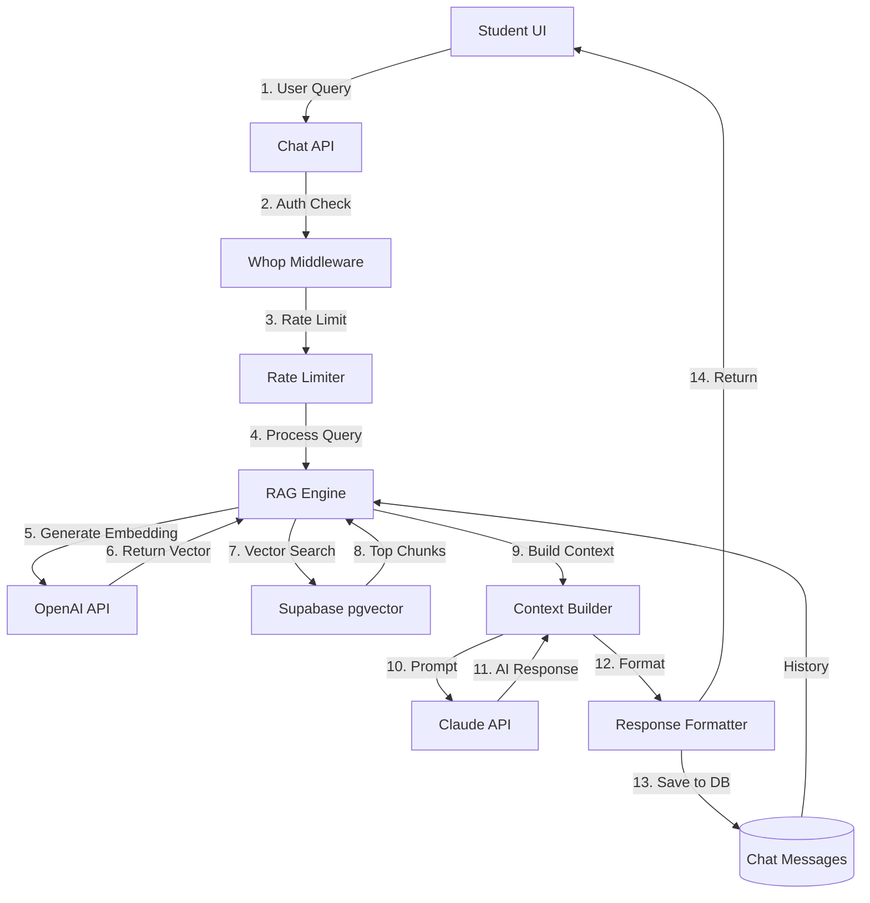

# RAG Chat Engine - Architecture

## System Design

### High-Level Architecture



### Component Breakdown

#### 1. Chat API Layer (`app/api/chat/`)
**Responsibility**: Handle HTTP requests, auth, validation

```typescript
// Entry point for all chat requests
POST /api/chat
├── Validate request body
├── Check Whop authentication
├── Verify rate limits
├── Call RAG Engine
└── Return formatted response

GET /api/chat/history
├── Get session ID
├── Fetch messages from DB
└── Return chronological history

POST /api/chat/feedback
├── Validate message ID
├── Store thumbs up/down
└── Update message record
```

**Key Files**:
- `app/api/chat/route.ts` - Main chat endpoint
- `app/api/chat/history/route.ts` - Conversation history
- `app/api/chat/feedback/route.ts` - Feedback submission

#### 2. RAG Engine (`lib/rag/rag-engine.ts`)
**Responsibility**: Orchestrate the entire RAG pipeline

```typescript
class RAGEngine {
  async chat(query: string, sessionId: string, creatorId: string) {
    // 1. Load conversation history
    const history = await this.getHistory(sessionId);

    // 2. Generate query embedding
    const embedding = await vectorSearch.generateEmbedding(query);

    // 3. Search for relevant chunks
    const chunks = await vectorSearch.search(embedding, creatorId, {
      limit: 5,
      threshold: 0.7 // Minimum similarity score
    });

    // 4. Build context from chunks
    const context = contextBuilder.build(chunks, history);

    // 5. Generate AI response
    const response = await this.generateResponse(query, context);

    // 6. Store message in DB
    await this.saveMessage(sessionId, query, response);

    return response;
  }
}
```

**Data Flow**:
```
Query → Embedding → Vector Search → Chunks → Context → Claude → Response
```

#### 3. Vector Search Service (`lib/rag/vector-search.ts`)
**Responsibility**: Embedding generation and similarity search

```typescript
class VectorSearchService {
  async generateEmbedding(text: string): Promise<number[]> {
    const response = await openai.embeddings.create({
      model: 'text-embedding-ada-002',
      input: text,
    });
    return response.data[0].embedding; // 1536 dimensions
  }

  async search(
    embedding: number[],
    creatorId: string,
    options: SearchOptions
  ): Promise<VideoChunk[]> {
    // Use pgvector cosine similarity
    const { data } = await supabase
      .from('video_chunks')
      .select('*, videos(*)')
      .eq('videos.creator_id', creatorId)
      .order('embedding <=> $1', {
        ascending: true,
        foreignTable: 'embedding'
      })
      .limit(options.limit);

    // Filter by similarity threshold
    return data.filter(chunk =>
      cosineSimilarity(embedding, chunk.embedding) >= options.threshold
    );
  }
}
```

**Vector Search SQL**:
```sql
SELECT
  vc.id,
  vc.chunk_text,
  vc.start_timestamp,
  vc.end_timestamp,
  v.id as video_id,
  v.title,
  (vc.embedding <=> $1::vector) as distance
FROM video_chunks vc
JOIN videos v ON v.id = vc.video_id
WHERE v.creator_id = $2
ORDER BY vc.embedding <=> $1::vector
LIMIT 5;
```

#### 4. Context Builder (`lib/rag/context-builder.ts`)
**Responsibility**: Format chunks into Claude-optimized context

```typescript
class ContextBuilder {
  build(chunks: VideoChunk[], history: ChatMessage[]): string {
    // Build conversation history
    const conversationContext = history
      .slice(-5) // Last 5 messages for context
      .map(msg => `${msg.role}: ${msg.content}`)
      .join('\n\n');

    // Build knowledge base from chunks
    const knowledgeBase = chunks.map((chunk, idx) => `
[Source ${idx + 1}]
Video: ${chunk.video.title}
Timestamp: ${formatTimestamp(chunk.start_timestamp)}
Content: ${chunk.chunk_text}
    `).join('\n\n');

    return `
# Knowledge Base
${knowledgeBase}

# Conversation History
${conversationContext}

# Instructions
Use the Knowledge Base to answer the student's question.
ALWAYS cite specific videos with timestamps.
If the answer isn't in the Knowledge Base, say "I don't have information about that in the course content."
    `.trim();
  }
}
```

#### 5. Chat Service (`lib/rag/chat-service.ts`)
**Responsibility**: Database operations for chat sessions and messages

```typescript
class ChatService {
  async createSession(studentId: string, creatorId: string) {
    const { data } = await supabase
      .from('chat_sessions')
      .insert({
        student_id: studentId,
        creator_id: creatorId,
        title: 'New Conversation',
      })
      .select()
      .single();

    return data;
  }

  async saveMessage(
    sessionId: string,
    role: 'user' | 'assistant',
    content: string,
    videoReferences?: VideoReference[]
  ) {
    return await supabase
      .from('chat_messages')
      .insert({
        session_id: sessionId,
        role,
        content,
        video_references: videoReferences,
      });
  }

  async getHistory(sessionId: string, limit = 10) {
    const { data } = await supabase
      .from('chat_messages')
      .select('*')
      .eq('session_id', sessionId)
      .order('created_at', { ascending: true })
      .limit(limit);

    return data;
  }
}
```

### Database Schema

#### chat_sessions
```sql
CREATE TABLE chat_sessions (
    id UUID PRIMARY KEY,
    student_id UUID REFERENCES students(id),
    creator_id UUID REFERENCES creators(id),
    title VARCHAR(255),
    context_type VARCHAR(50), -- 'general', 'project-specific', 'quiz-help'
    created_at TIMESTAMP,
    updated_at TIMESTAMP
);
```

#### chat_messages
```sql
CREATE TABLE chat_messages (
    id UUID PRIMARY KEY,
    session_id UUID REFERENCES chat_sessions(id),
    role VARCHAR(20), -- 'user' or 'assistant'
    content TEXT,
    video_references JSONB, -- Array of {video_id, title, timestamp, relevance_score}
    feedback VARCHAR(20), -- 'positive', 'negative', null
    created_at TIMESTAMP
);
```

### Claude API Integration

#### Prompt Structure
```typescript
const systemPrompt = `You are an AI teaching assistant for an online course.

Your role:
- Answer student questions using ONLY the provided course content
- Cite specific videos with timestamps
- Be encouraging and supportive
- If you don't know, admit it

Response format:
1. Direct answer to the question
2. Video references with timestamps
3. Suggest next steps if applicable

Example response:
"To implement authentication in React, you'll want to use context and hooks.

📹 Check out 'React Authentication Basics' at 5:32 where this is covered in detail.
📹 Also see 'Context API Deep Dive' at 12:15 for state management.

Next, you might want to learn about protected routes!"`;

const response = await anthropic.messages.create({
  model: 'claude-3-5-sonnet-20241022',
  max_tokens: 1024,
  system: systemPrompt,
  messages: [
    {
      role: 'user',
      content: `${context}\n\nQuestion: ${query}`
    }
  ],
});
```

### Performance Optimizations

#### 1. Caching Strategy
```typescript
// Cache common questions
const cacheKey = `chat:${creatorId}:${hashQuery(query)}`;
const cached = await cache.get(cacheKey);

if (cached) {
  return cached;
}

const response = await ragEngine.chat(query, sessionId, creatorId);

// Cache for 30 days
await cache.set(cacheKey, response, { ex: 30 * 24 * 60 * 60 });
```

#### 2. Rate Limiting
```typescript
const key = `rate_limit:chat:${studentId}`;
const count = await redis.incr(key);

if (count === 1) {
  await redis.expire(key, 60); // 1 minute window
}

if (count > 20) {
  throw new Error('Rate limit exceeded: 20 requests per minute');
}
```

#### 3. Connection Pooling
```typescript
// Reuse Supabase client
export const supabase = createClient(url, key, {
  db: {
    poolSize: 10, // Connection pool
  },
});
```

### Error Handling

```typescript
try {
  const response = await ragEngine.chat(query, sessionId, creatorId);
  return response;
} catch (error) {
  if (error instanceof RateLimitError) {
    return {
      error: 'Too many requests. Please wait a moment.',
      code: 'RATE_LIMIT',
    };
  }

  if (error instanceof ClaudeAPIError) {
    Sentry.captureException(error);
    return {
      error: 'AI service temporarily unavailable. Please try again.',
      code: 'AI_ERROR',
    };
  }

  // Generic error
  Sentry.captureException(error);
  return {
    error: 'Something went wrong. Please try again.',
    code: 'UNKNOWN_ERROR',
  };
}
```

### Security Considerations

1. **Multi-tenancy**: Always filter by `creator_id` in vector search
2. **Rate Limiting**: 20 requests/minute per student
3. **Input Validation**: Sanitize user queries (max 500 characters)
4. **Auth Check**: Verify Whop membership before processing
5. **Response Filtering**: Don't leak sensitive data in responses

### Scalability

#### Current Capacity
- Supports up to 1000 concurrent students
- ~100 queries per second
- Vector search <500ms (95th percentile)

#### Future Scaling
- Add read replicas for database
- Implement distributed caching (Redis Cluster)
- Use Claude API with higher rate limits
- Shard vector index by creator

### Monitoring

#### Key Metrics to Track
```typescript
// Response time
metrics.timing('chat.response_time', duration);

// Success rate
metrics.increment('chat.success');

// Error rate
metrics.increment('chat.error', { error_type: 'claude_api' });

// Feedback
metrics.increment('chat.feedback', { type: 'positive' });

// Cost tracking
metrics.increment('chat.claude_tokens', tokens);
```

### Next Steps
1. Read `IMPLEMENTATION.md` for step-by-step build guide
2. Review `API_SPEC.md` for detailed API contracts
3. Check `COMPONENTS.md` for UI implementation
