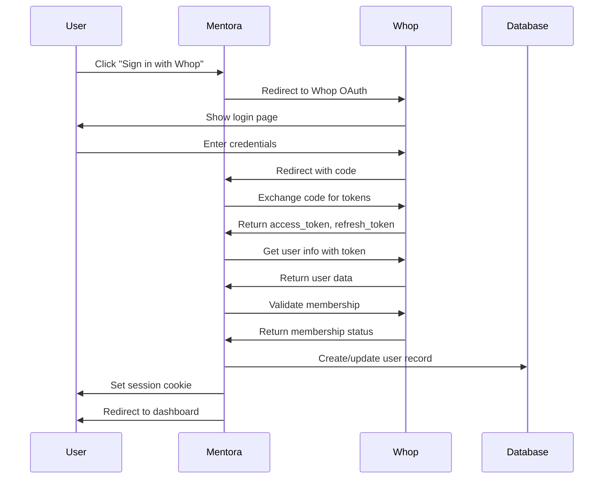

# Module 7: Whop Integration - Overview

## ⚠️ CRITICAL MODULE - SECURITY SENSITIVE ⚠️

## Executive Summary

The Whop Integration module provides seamless authentication, membership management, and payment processing through the Whop platform. **This is the gateway to your app - get it wrong and the entire platform is compromised.**

**Status**: Full Implementation Required
**Priority**: P0 (CRITICAL - Nothing works without this)
**Dependencies**: Backend Infrastructure (Module 8)

## Problem Statement

### What Whop Provides
- **Built-in User Base**: Access to Whop's existing creator/student ecosystem
- **Payment Processing**: Stripe integration handled by Whop
- **Membership Management**: Automatic subscription handling
- **OAuth Authentication**: Secure, trusted login
- **Developer Tools**: SDKs, webhooks, comprehensive API

### Why We Need This
- No separate login system to build/maintain
- Automatic membership validation
- Payment events handled automatically
- Trust & credibility from Whop brand
- Built-in community features

## Security Requirements (NON-NEGOTIABLE)

### 🔒 CRITICAL Security Rules

1. **NEVER expose client secret to frontend**
2. **ALWAYS verify webhook signatures**
3. **ALWAYS validate membership before granting access**
4. **NEVER trust client-side data**
5. **ALWAYS use HTTPS in production**
6. **ALWAYS log authentication events**
7. **NEVER store Whop API keys in code**

### Security Checklist

```
[ ] Environment variables secured
[ ] Webhook signature verification implemented
[ ] CSRF protection enabled
[ ] Rate limiting on auth endpoints
[ ] Secure session storage (httpOnly cookies)
[ ] Token refresh logic implemented
[ ] Membership validation on every request
[ ] Audit logging for all auth events
[ ] Error messages don't leak sensitive info
[ ] Test with invalid/expired tokens
```

## Whop Integration Flow

### OAuth 2.0 Authentication Flow



### Webhook Event Handling

```typescript
// Webhook events from Whop
{
  "event": "membership.created",
  "data": {
    "id": "mem_xxx",
    "user_id": "user_xxx",
    "company_id": "comp_xxx",
    "product_id": "prod_xxx",
    "status": "active",
    "valid": true,
    "created_at": "2025-10-20T10:00:00Z"
  },
  "timestamp": "2025-10-20T10:00:05Z",
  "signature": "sha256=xxx..."
}
```

**Events to Handle**:
1. `membership.created` → Provision student access, send welcome email
2. `membership.expired` → Revoke access, send renewal reminder
3. `membership.cancelled` → Soft delete or mark inactive
4. `payment.succeeded` → Log for analytics, send receipt
5. `payment.failed` → Alert creator, pause access if configured

## Implementation Components

### 1. OAuth Service

```typescript
// lib/whop/auth.ts
export class WhopAuthService {
  private readonly clientId = process.env.WHOP_CLIENT_ID!;
  private readonly clientSecret = process.env.WHOP_CLIENT_SECRET!;
  private readonly redirectUri = `${process.env.NEXT_PUBLIC_APP_URL}/api/whop/callback`;

  /**
   * Generate authorization URL
   */
  getAuthUrl(state: string): string {
    const params = new URLSearchParams({
      client_id: this.clientId,
      redirect_uri: this.redirectUri,
      response_type: 'code',
      scope: 'user:read membership:read',
      state, // CSRF protection
    });

    return `https://whop.com/oauth/authorize?${params}`;
  }

  /**
   * Exchange code for tokens
   */
  async exchangeCodeForTokens(code: string): Promise<Tokens> {
    const response = await fetch('https://api.whop.com/oauth/token', {
      method: 'POST',
      headers: { 'Content-Type': 'application/json' },
      body: JSON.stringify({
        grant_type: 'authorization_code',
        code,
        client_id: this.clientId,
        client_secret: this.clientSecret,
        redirect_uri: this.redirectUri,
      }),
    });

    if (!response.ok) {
      throw new Error('Token exchange failed');
    }

    return response.json();
  }

  /**
   * Refresh access token
   */
  async refreshToken(refreshToken: string): Promise<Tokens> {
    // Implementation...
  }
}
```

### 2. Webhook Verifier

```typescript
// lib/whop/webhooks.ts
import crypto from 'crypto';

export class WhopWebhookService {
  private readonly secret = process.env.WHOP_WEBHOOK_SECRET!;

  /**
   * Verify webhook signature (CRITICAL FOR SECURITY)
   */
  verifySignature(payload: string, signature: string): boolean {
    const expectedSignature = crypto
      .createHmac('sha256', this.secret)
      .update(payload)
      .digest('hex');

    // Use timing-safe comparison to prevent timing attacks
    return crypto.timingSafeEqual(
      Buffer.from(signature),
      Buffer.from(`sha256=${expectedSignature}`)
    );
  }

  /**
   * Handle webhook event (with idempotency)
   */
  async handleEvent(event: WhopWebhookEvent): Promise<void> {
    // Check if already processed (idempotency)
    const processed = await this.isEventProcessed(event.id);
    if (processed) {
      console.log('Event already processed:', event.id);
      return;
    }

    try {
      switch (event.event) {
        case 'membership.created':
          await this.handleMembershipCreated(event.data);
          break;
        case 'membership.expired':
          await this.handleMembershipExpired(event.data);
          break;
        case 'payment.succeeded':
          await this.handlePaymentSucceeded(event.data);
          break;
        default:
          console.log('Unhandled event type:', event.event);
      }

      // Mark as processed
      await this.markEventProcessed(event.id);
    } catch (error) {
      console.error('Webhook handler error:', error);
      throw error; // Whop will retry
    }
  }

  private async handleMembershipCreated(data: any): Promise<void> {
    // Create student record
    await supabaseAdmin.from('students').insert({
      whop_user_id: data.user_id,
      whop_membership_id: data.id,
      creator_id: await this.getCreatorIdFromCompany(data.company_id),
      onboarding_completed: false,
    });

    // Send welcome email
    await sendWelcomeEmail(data.user_id);
  }
}
```

### 3. Membership Validator

```typescript
// lib/whop/membership.ts
export class MembershipValidator {
  /**
   * Check if user has valid membership
   */
  async validateMembership(userId: string): Promise<ValidationResult> {
    const { data: student } = await supabase
      .from('students')
      .select('whop_membership_id')
      .eq('whop_user_id', userId)
      .single();

    if (!student) {
      return { valid: false, reason: 'NO_MEMBERSHIP' };
    }

    // Call Whop API to verify membership is still active
    const membership = await this.checkWhopMembership(student.whop_membership_id);

    if (!membership.valid) {
      return { valid: false, reason: 'EXPIRED' };
    }

    if (membership.status !== 'active') {
      return { valid: false, reason: 'INACTIVE' };
    }

    return { valid: true, tier: membership.tier };
  }

  private async checkWhopMembership(membershipId: string) {
    const response = await fetch(
      `https://api.whop.com/v1/memberships/${membershipId}`,
      {
        headers: {
          'Authorization': `Bearer ${process.env.WHOP_API_KEY}`,
        },
      }
    );

    if (!response.ok) {
      throw new Error('Failed to check membership');
    }

    return response.json();
  }
}
```

### 4. Auth Middleware

```typescript
// middleware.ts (Next.js)
import { NextRequest, NextResponse } from 'next/server';

export async function middleware(request: NextRequest) {
  const path = request.nextUrl.pathname;

  // Public routes (no auth needed)
  const publicRoutes = ['/', '/api/whop/callback', '/api/whop/webhooks'];
  if (publicRoutes.some(route => path.startsWith(route))) {
    return NextResponse.next();
  }

  // Check session
  const token = request.cookies.get('whop_access_token');
  if (!token) {
    return NextResponse.redirect(new URL('/login', request.url));
  }

  // Validate token and membership
  try {
    const validation = await validateSession(token.value);
    if (!validation.valid) {
      return NextResponse.redirect(new URL('/login', request.url));
    }

    // Add user to request headers
    const response = NextResponse.next();
    response.headers.set('X-User-Id', validation.userId);
    response.headers.set('X-Membership-Tier', validation.tier);

    return response;
  } catch (error) {
    console.error('Middleware error:', error);
    return NextResponse.redirect(new URL('/login', request.url));
  }
}

export const config = {
  matcher: [
    '/dashboard/:path*',
    '/api/:path*',
  ],
};
```

## API Endpoints

### GET /api/whop/auth
Initiate OAuth flow

### GET /api/whop/callback
Handle OAuth callback, exchange code for tokens

### POST /api/whop/webhooks
Receive webhook events (MUST verify signature!)

### GET /api/whop/verify
Verify current session

### POST /api/whop/refresh
Refresh access token

## Environment Variables

```env
# REQUIRED
WHOP_API_KEY=whop_xxx              # For API calls
WHOP_CLIENT_ID=client_xxx          # OAuth client ID
WHOP_CLIENT_SECRET=secret_xxx      # OAuth client secret (NEVER expose!)
WHOP_WEBHOOK_SECRET=webhook_xxx    # For signature verification

# OPTIONAL
WHOP_REDIRECT_URI=http://localhost:3000/api/whop/callback  # Override default
```

## Testing Strategy

### Unit Tests
- OAuth URL generation
- Token exchange logic
- Signature verification
- Membership validation

### Integration Tests
- Full OAuth flow (use test credentials)
- Webhook processing
- Token refresh
- Access control

### Security Tests
- Invalid signatures rejected
- Expired tokens rejected
- Invalid memberships rejected
- CSRF protection working
- Rate limiting functional

## Common Issues & Solutions

### Issue: "Invalid signature" on webhooks
**Cause**: Using wrong secret or payload encoding
**Solution**: Log payload and signature, verify secret

### Issue: OAuth callback fails
**Cause**: Redirect URI mismatch
**Solution**: Ensure URI exactly matches Whop dashboard setting

### Issue: Token expired errors
**Cause**: No refresh logic
**Solution**: Implement automatic token refresh

### Issue: Webhooks received twice
**Cause**: No idempotency check
**Solution**: Store processed event IDs in database

## Security Incidents Response

If compromised:
1. **Immediately** rotate all API keys in Whop dashboard
2. Revoke all active sessions
3. Investigate logs for unauthorized access
4. Notify affected users
5. Review and patch security hole
6. Document incident for future prevention

## Next Steps

1. Read `OAUTH_FLOW.md` - Detailed authentication flow
2. Read `WEBHOOKS.md` - Every webhook event
3. Read `SECURITY.md` - Security best practices ⚠️
4. Read `IMPLEMENTATION.md` - Step-by-step guide
5. Review `TESTING.md` - Security test scenarios

---

**⚠️ REMEMBER: This module is the front door. Get it right!**
