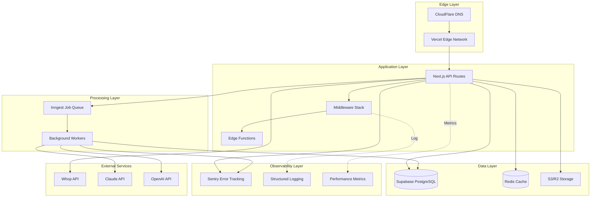

# Module 8: Backend Infrastructure - Architecture

## System Architecture Overview



## Database Architecture

### Connection Management

```typescript
// lib/infrastructure/database/connection-pool.ts

import { createClient, SupabaseClient } from '@supabase/supabase-js';
import { Database } from '@/types/database';

// Singleton pattern for connection reuse
let supabaseInstance: SupabaseClient<Database> | null = null;
let adminInstance: SupabaseClient<Database> | null = null;

/**
 * Get Supabase client (for client-side and API routes)
 * Implements connection pooling via Supabase's built-in PgBouncer
 */
export function getSupabaseClient(): SupabaseClient<Database> {
  if (!supabaseInstance) {
    supabaseInstance = createClient<Database>(
      process.env.NEXT_PUBLIC_SUPABASE_URL!,
      process.env.NEXT_PUBLIC_SUPABASE_ANON_KEY!,
      {
        auth: {
          persistSession: true,
          autoRefreshToken: true,
          detectSessionInUrl: true,
        },
        db: {
          schema: 'public',
        },
        global: {
          headers: {
            'x-application-name': 'mentora-web',
          },
        },
      }
    );
  }
  return supabaseInstance;
}

/**
 * Get Supabase admin client (bypasses RLS)
 * USE WITH CAUTION - only in server-side contexts
 */
export function getSupabaseAdmin(): SupabaseClient<Database> {
  if (!adminInstance) {
    if (!process.env.SUPABASE_SERVICE_ROLE_KEY) {
      throw new Error('SUPABASE_SERVICE_ROLE_KEY not configured');
    }

    adminInstance = createClient<Database>(
      process.env.NEXT_PUBLIC_SUPABASE_URL!,
      process.env.SUPABASE_SERVICE_ROLE_KEY,
      {
        auth: {
          autoRefreshToken: false,
          persistSession: false,
        },
        db: {
          schema: 'public',
        },
      }
    );
  }
  return adminInstance;
}

/**
 * Health check for database connection
 */
export async function checkDatabaseHealth(): Promise<{
  healthy: boolean;
  latency: number;
  error?: string;
}> {
  const start = Date.now();

  try {
    const { data, error } = await getSupabaseClient()
      .from('creators')
      .select('id')
      .limit(1);

    const latency = Date.now() - start;

    if (error) {
      return { healthy: false, latency, error: error.message };
    }

    return { healthy: true, latency };
  } catch (error) {
    return {
      healthy: false,
      latency: Date.now() - start,
      error: error instanceof Error ? error.message : 'Unknown error',
    };
  }
}
```

### Query Patterns

```typescript
// lib/infrastructure/database/query-builder.ts

import { getSupabaseClient, getSupabaseAdmin } from './connection-pool';
import type { Database } from '@/types/database';

type Tables = Database['public']['Tables'];
type TableName = keyof Tables;

/**
 * Optimized query builder with common patterns
 */
export class QueryBuilder<T extends TableName> {
  constructor(
    private table: T,
    private useAdmin = false
  ) {}

  private get client() {
    return this.useAdmin ? getSupabaseAdmin() : getSupabaseClient();
  }

  /**
   * Get by ID with type safety
   */
  async getById(
    id: string,
    select = '*'
  ): Promise<Tables[T]['Row'] | null> {
    const { data, error } = await this.client
      .from(this.table)
      .select(select)
      .eq('id', id)
      .single();

    if (error) {
      throw new Error(`Failed to fetch ${this.table} by ID: ${error.message}`);
    }

    return data;
  }

  /**
   * Paginated list with cursor-based pagination
   */
  async list(options: {
    select?: string;
    filters?: Record<string, any>;
    orderBy?: string;
    orderDirection?: 'asc' | 'desc';
    limit?: number;
    cursor?: string;
  }) {
    let query = this.client.from(this.table).select(options.select || '*');

    // Apply filters
    if (options.filters) {
      Object.entries(options.filters).forEach(([key, value]) => {
        query = query.eq(key, value);
      });
    }

    // Apply cursor pagination
    if (options.cursor && options.orderBy) {
      const direction = options.orderDirection || 'asc';
      query = query[direction === 'asc' ? 'gt' : 'lt'](
        options.orderBy,
        options.cursor
      );
    }

    // Apply ordering
    if (options.orderBy) {
      query = query.order(options.orderBy, {
        ascending: options.orderDirection !== 'desc',
      });
    }

    // Apply limit
    query = query.limit(options.limit || 50);

    const { data, error } = await query;

    if (error) {
      throw new Error(`Failed to list ${this.table}: ${error.message}`);
    }

    return {
      data: data || [],
      nextCursor:
        data && data.length > 0 && options.orderBy
          ? data[data.length - 1][options.orderBy]
          : null,
    };
  }

  /**
   * Batch insert with type safety
   */
  async insertMany(
    rows: Tables[T]['Insert'][]
  ): Promise<Tables[T]['Row'][]> {
    const { data, error } = await this.client
      .from(this.table)
      .insert(rows)
      .select();

    if (error) {
      throw new Error(`Failed to insert into ${this.table}: ${error.message}`);
    }

    return data || [];
  }

  /**
   * Update with optimistic locking
   */
  async update(
    id: string,
    updates: Tables[T]['Update'],
    expectedVersion?: number
  ): Promise<Tables[T]['Row']> {
    let query = this.client
      .from(this.table)
      .update(updates)
      .eq('id', id);

    // Optimistic locking check
    if (expectedVersion !== undefined && 'version' in updates) {
      query = query.eq('version', expectedVersion);
    }

    const { data, error } = await query.select().single();

    if (error) {
      if (error.code === 'PGRST116') {
        throw new Error('Optimistic lock failed - record was modified');
      }
      throw new Error(`Failed to update ${this.table}: ${error.message}`);
    }

    return data;
  }
}

// Usage examples
const videoQuery = new QueryBuilder('videos');
const video = await videoQuery.getById('xxx-xxx');

const videosQuery = new QueryBuilder('videos');
const { data, nextCursor } = await videosQuery.list({
  filters: { creator_id: 'creator-123' },
  orderBy: 'created_at',
  orderDirection: 'desc',
  limit: 20,
});
```

### Index Strategy

```sql
-- High-performance indexes for common queries

-- Video chunks vector search (CRITICAL for chat)
CREATE INDEX idx_video_chunks_embedding ON video_chunks
USING ivfflat (embedding vector_cosine_ops)
WITH (lists = 100);

-- Video chunks by video (for retrieval)
CREATE INDEX idx_video_chunks_video_id ON video_chunks(video_id);

-- Chat sessions by student (for history)
CREATE INDEX idx_chat_sessions_student ON chat_sessions(student_id, created_at DESC);

-- Chat messages by session (for context building)
CREATE INDEX idx_chat_messages_session ON chat_messages(session_id, created_at ASC);

-- Video progress by student (for dashboard)
CREATE INDEX idx_video_progress_student ON video_progress(student_id, last_watched DESC);

-- Quiz attempts by student (for analytics)
CREATE INDEX idx_quiz_attempts_student ON quiz_attempts(student_id, created_at DESC);

-- Project submissions by student (for portfolio)
CREATE INDEX idx_project_submissions_student ON project_submissions(student_id, submitted_at DESC);

-- Achievements by student (for profile)
CREATE INDEX idx_student_achievements_student ON student_achievements(student_id, unlocked_at DESC);

-- Analytics events (time-series, use BRIN)
CREATE INDEX idx_analytics_events_time ON analytics_events USING BRIN (created_at);

-- Multi-column composite indexes for common filters
CREATE INDEX idx_videos_creator_status ON videos(creator_id, processing_status, created_at DESC);
CREATE INDEX idx_students_creator_active ON students(creator_id, last_active DESC) WHERE onboarding_completed = true;
```

## Caching Architecture

### Cache Layer Design

```typescript
// lib/infrastructure/cache/redis-client.ts

import { Redis } from '@upstash/redis';

const redis = new Redis({
  url: process.env.REDIS_URL!,
  token: process.env.REDIS_TOKEN!,
});

/**
 * Type-safe cache wrapper with TTL
 */
export class CacheService {
  /**
   * Get cached value with automatic deserialization
   */
  async get<T>(key: string): Promise<T | null> {
    const value = await redis.get(key);
    return value as T | null;
  }

  /**
   * Set cached value with TTL (seconds)
   */
  async set<T>(key: string, value: T, ttl: number): Promise<void> {
    await redis.setex(key, ttl, value);
  }

  /**
   * Delete cached value
   */
  async delete(key: string): Promise<void> {
    await redis.del(key);
  }

  /**
   * Delete multiple keys by pattern
   */
  async deletePattern(pattern: string): Promise<number> {
    const keys = await redis.keys(pattern);
    if (keys.length === 0) return 0;
    return await redis.del(...keys);
  }

  /**
   * Get or compute (cache-aside pattern)
   */
  async getOrCompute<T>(
    key: string,
    computeFn: () => Promise<T>,
    ttl: number
  ): Promise<T> {
    // Try cache first
    const cached = await this.get<T>(key);
    if (cached !== null) {
      return cached;
    }

    // Cache miss - compute value
    const value = await computeFn();

    // Store in cache (fire and forget)
    this.set(key, value, ttl).catch(err => {
      console.error('Cache set failed:', err);
    });

    return value;
  }

  /**
   * Increment counter (for rate limiting)
   */
  async increment(key: string, ttl: number): Promise<number> {
    const pipeline = redis.pipeline();
    pipeline.incr(key);
    pipeline.expire(key, ttl);
    const results = await pipeline.exec();
    return results[0] as number;
  }

  /**
   * Check cache health
   */
  async healthCheck(): Promise<{ healthy: boolean; latency: number }> {
    const start = Date.now();
    try {
      await redis.ping();
      return { healthy: true, latency: Date.now() - start };
    } catch (error) {
      return { healthy: false, latency: Date.now() - start };
    }
  }
}

export const cache = new CacheService();
```

### Cache Key Patterns

```typescript
// lib/infrastructure/cache/cache-keys.ts

/**
 * Centralized cache key generation with namespacing
 */
export const CacheKeys = {
  // Chat session context (10 min TTL)
  chatSession: (sessionId: string) => `chat:session:${sessionId}`,
  chatHistory: (sessionId: string) => `chat:history:${sessionId}`,

  // User membership validation (5 min TTL)
  membership: (userId: string) => `membership:${userId}`,

  // Video metadata (1 hour TTL)
  video: (videoId: string) => `video:${videoId}`,
  videosByCreator: (creatorId: string, page: number) =>
    `videos:creator:${creatorId}:page:${page}`,

  // AI embeddings (permanent, LRU eviction)
  embedding: (text: string) => {
    const hash = simpleHash(text);
    return `embedding:${hash}`;
  },

  // Rate limiting (1 min sliding window)
  rateLimit: (identifier: string, endpoint: string) =>
    `ratelimit:${endpoint}:${identifier}`,

  // Creator settings (30 min TTL)
  creatorSettings: (creatorId: string) => `creator:settings:${creatorId}`,

  // Student progress (15 min TTL)
  studentProgress: (studentId: string) => `student:progress:${studentId}`,
  studentAchievements: (studentId: string) =>
    `student:achievements:${studentId}`,

  // Quiz results (1 hour TTL)
  quizAttempt: (attemptId: string) => `quiz:attempt:${attemptId}`,

  // Pattern for invalidation
  studentPattern: (studentId: string) => `student:*:${studentId}*`,
  creatorPattern: (creatorId: string) => `*:creator:${creatorId}:*`,
} as const;

// Simple hash function for cache keys
function simpleHash(str: string): string {
  let hash = 0;
  for (let i = 0; i < str.length; i++) {
    const char = str.charCodeAt(i);
    hash = (hash << 5) - hash + char;
    hash = hash & hash; // Convert to 32-bit integer
  }
  return Math.abs(hash).toString(36);
}

/**
 * TTL constants (in seconds)
 */
export const CacheTTL = {
  SHORT: 60, // 1 minute
  MEDIUM: 300, // 5 minutes
  LONG: 3600, // 1 hour
  DAY: 86400, // 24 hours
  PERMANENT: -1, // No expiration (LRU eviction)
} as const;
```

### Cache Invalidation Strategy

```typescript
// lib/infrastructure/cache/cache-invalidation.ts

import { cache } from './redis-client';
import { CacheKeys } from './cache-keys';

/**
 * Cache invalidation handlers for data mutations
 */
export class CacheInvalidator {
  /**
   * Invalidate when student data changes
   */
  static async onStudentUpdate(studentId: string): Promise<void> {
    await cache.deletePattern(CacheKeys.studentPattern(studentId));
  }

  /**
   * Invalidate when creator data changes
   */
  static async onCreatorUpdate(creatorId: string): Promise<void> {
    await cache.deletePattern(CacheKeys.creatorPattern(creatorId));
  }

  /**
   * Invalidate when video is updated
   */
  static async onVideoUpdate(videoId: string, creatorId: string): Promise<void> {
    await Promise.all([
      cache.delete(CacheKeys.video(videoId)),
      cache.deletePattern(CacheKeys.creatorPattern(creatorId)),
    ]);
  }

  /**
   * Invalidate when membership status changes
   */
  static async onMembershipChange(userId: string): Promise<void> {
    await cache.delete(CacheKeys.membership(userId));
  }

  /**
   * Invalidate chat session (e.g., when session ends)
   */
  static async onChatSessionEnd(sessionId: string): Promise<void> {
    await Promise.all([
      cache.delete(CacheKeys.chatSession(sessionId)),
      cache.delete(CacheKeys.chatHistory(sessionId)),
    ]);
  }
}
```

## Job Queue Architecture

### Inngest Configuration

```typescript
// lib/infrastructure/jobs/inngest-client.ts

import { Inngest, EventSchemas } from 'inngest';

/**
 * Define all event schemas for type safety
 */
type Events = {
  'video/upload.completed': {
    data: {
      videoId: string;
      creatorId: string;
      videoUrl: string;
      duration: number;
    };
  };
  'video/transcription.completed': {
    data: {
      videoId: string;
      transcriptUrl: string;
    };
  };
  'quiz/generation.requested': {
    data: {
      quizId: string;
      videoId: string;
      creatorId: string;
      questionCount: number;
    };
  };
  'student/achievement.unlocked': {
    data: {
      studentId: string;
      achievementId: string;
      xpEarned: number;
    };
  };
  'analytics/daily.aggregate': {
    data: {
      date: string;
    };
  };
  'email/send': {
    data: {
      to: string;
      template: string;
      variables: Record<string, any>;
    };
  };
};

export const inngest = new Inngest({
  id: 'mentora',
  schemas: new EventSchemas().fromRecord<Events>(),
  eventKey: process.env.INNGEST_EVENT_KEY,
});
```

### Job Functions

```typescript
// lib/infrastructure/jobs/functions/process-video.ts

import { inngest } from '../inngest-client';
import { WhisperService } from '@/lib/video/transcription';
import { IntelligentChunker } from '@/lib/video/chunking';
import { EmbeddingService } from '@/lib/rag/embeddings';
import { getSupabaseAdmin } from '@/lib/infrastructure/database/connection-pool';

/**
 * Video processing pipeline (long-running, 10-60 minutes)
 */
export const processVideo = inngest.createFunction(
  {
    id: 'process-video',
    name: 'Process Uploaded Video',
    retries: 3,
    rateLimit: {
      limit: 5, // Max 5 concurrent video processing jobs
      period: '1m',
    },
  },
  { event: 'video/upload.completed' },
  async ({ event, step, logger }) => {
    const { videoId, videoUrl, creatorId } = event.data;

    logger.info('Starting video processing', { videoId, creatorId });

    // Step 1: Update status to processing
    await step.run('update-status-processing', async () => {
      await getSupabaseAdmin()
        .from('videos')
        .update({ processing_status: 'processing' })
        .eq('id', videoId);

      return { status: 'processing' };
    });

    // Step 2: Extract audio (5-10 seconds)
    const audioBuffer = await step.run('extract-audio', async () => {
      // Extract audio from video using ffmpeg
      const audio = await extractAudioFromVideo(videoUrl);
      logger.info('Audio extracted', {
        videoId,
        size: audio.length,
      });
      return audio;
    });

    // Step 3: Transcribe with Whisper (varies by length)
    const transcript = await step.run('transcribe', async () => {
      const whisper = new WhisperService();
      const result = await whisper.transcribe(audioBuffer);

      logger.info('Transcription completed', {
        videoId,
        wordCount: result.text.split(' ').length,
        segments: result.segments.length,
      });

      // Store full transcript
      await getSupabaseAdmin()
        .from('videos')
        .update({
          full_transcript: result.text,
          transcript_data: result,
        })
        .eq('id', videoId);

      return result;
    });

    // Step 4: Chunk transcript (1-2 seconds)
    const chunks = await step.run('chunk-transcript', async () => {
      const chunker = new IntelligentChunker();
      const textChunks = chunker.chunk(transcript);

      logger.info('Chunking completed', {
        videoId,
        chunkCount: textChunks.length,
      });

      return textChunks;
    });

    // Step 5: Generate embeddings (parallel, 2-5 minutes)
    await step.run('generate-embeddings', async () => {
      const embedder = new EmbeddingService();

      // Process in batches of 10 to avoid rate limits
      const BATCH_SIZE = 10;
      for (let i = 0; i < chunks.length; i += BATCH_SIZE) {
        const batch = chunks.slice(i, i + BATCH_SIZE);

        await Promise.all(
          batch.map(async (chunk, index) => {
            const embedding = await embedder.generateEmbedding(chunk.text);

            await getSupabaseAdmin().from('video_chunks').insert({
              video_id: videoId,
              chunk_text: chunk.text,
              chunk_index: i + index,
              start_timestamp: chunk.startTime,
              end_timestamp: chunk.endTime,
              embedding,
              topic_tags: chunk.topics,
            });
          })
        );

        logger.info('Batch processed', {
          videoId,
          processed: Math.min(i + BATCH_SIZE, chunks.length),
          total: chunks.length,
        });
      }

      return { chunksProcessed: chunks.length };
    });

    // Step 6: Mark complete
    await step.run('mark-complete', async () => {
      await getSupabaseAdmin()
        .from('videos')
        .update({
          processing_status: 'completed',
          processed_at: new Date().toISOString(),
        })
        .eq('id', videoId);

      logger.info('Video processing complete', { videoId });
    });

    // Step 7: Trigger quiz generation (optional)
    if (event.data.autoGenerateQuiz) {
      await step.sendEvent('trigger-quiz-generation', {
        name: 'quiz/generation.requested',
        data: {
          quizId: generateId(),
          videoId,
          creatorId,
          questionCount: 10,
        },
      });
    }

    return {
      success: true,
      videoId,
      chunksCreated: chunks.length,
    };
  }
);

// Error handler with retry logic
processVideo.onFailure(async ({ event, error, attempt }) => {
  if (attempt >= 3) {
    // Final failure - mark video as failed
    await getSupabaseAdmin()
      .from('videos')
      .update({
        processing_status: 'failed',
        error_message: error.message,
      })
      .eq('id', event.data.videoId);

    // Notify creator
    await inngest.send({
      name: 'email/send',
      data: {
        to: event.data.creatorEmail,
        template: 'video-processing-failed',
        variables: {
          videoId: event.data.videoId,
          error: error.message,
        },
      },
    });
  }
});
```

### Scheduled Jobs

```typescript
// lib/infrastructure/jobs/functions/scheduled-jobs.ts

import { inngest } from '../inngest-client';

/**
 * Daily analytics aggregation (runs at 2 AM UTC)
 */
export const aggregateDailyAnalytics = inngest.createFunction(
  {
    id: 'aggregate-daily-analytics',
    name: 'Aggregate Daily Analytics',
  },
  { cron: '0 2 * * *' }, // Every day at 2 AM UTC
  async ({ step, logger }) => {
    const yesterday = new Date();
    yesterday.setDate(yesterday.getDate() - 1);
    const dateString = yesterday.toISOString().split('T')[0];

    logger.info('Starting daily analytics aggregation', { date: dateString });

    await step.run('aggregate-metrics', async () => {
      // Aggregate from analytics_events table
      const { data } = await getSupabaseAdmin().rpc('aggregate_daily_metrics', {
        target_date: dateString,
      });

      logger.info('Aggregation complete', {
        date: dateString,
        metricsCount: data?.length || 0,
      });

      return data;
    });

    return { date: dateString };
  }
);

/**
 * Weekly content health check (runs every Sunday at 3 AM)
 */
export const checkContentHealth = inngest.createFunction(
  {
    id: 'check-content-health',
    name: 'Check Content Health',
  },
  { cron: '0 3 * * 0' }, // Every Sunday at 3 AM
  async ({ step, logger }) => {
    logger.info('Starting weekly content health check');

    const unhealthyVideos = await step.run('check-videos', async () => {
      // Check if videos are still accessible
      const { data: videos } = await getSupabaseAdmin()
        .from('videos')
        .select('id, video_url, creator_id')
        .eq('processing_status', 'completed');

      const results = await Promise.all(
        videos?.map(async video => {
          const accessible = await checkVideoAccessibility(video.video_url);
          if (!accessible) {
            logger.warn('Video not accessible', { videoId: video.id });
            return video;
          }
          return null;
        }) || []
      );

      return results.filter(Boolean);
    });

    // Notify creators of broken videos
    if (unhealthyVideos.length > 0) {
      await step.sendEvent('notify-creators', unhealthyVideos.map(video => ({
        name: 'email/send',
        data: {
          to: video.creatorEmail,
          template: 'video-health-alert',
          variables: { videoId: video.id },
        },
      })));
    }

    return { unhealthyCount: unhealthyVideos.length };
  }
);
```

## Rate Limiting Architecture

```typescript
// lib/infrastructure/rate-limiting/rate-limiter.ts

import { Ratelimit } from '@upstash/ratelimit';
import { Redis } from '@upstash/redis';

const redis = new Redis({
  url: process.env.REDIS_URL!,
  token: process.env.REDIS_TOKEN!,
});

/**
 * Rate limiter configurations for different endpoints
 */
export const rateLimiters = {
  // Chat endpoints - 20 requests per minute
  chat: new Ratelimit({
    redis,
    limiter: Ratelimit.slidingWindow(20, '1 m'),
    analytics: true,
    prefix: 'ratelimit:chat',
  }),

  // Video upload - 10 requests per hour
  videoUpload: new Ratelimit({
    redis,
    limiter: Ratelimit.fixedWindow(10, '1 h'),
    analytics: true,
    prefix: 'ratelimit:video-upload',
  }),

  // Quiz generation - 5 requests per hour
  quizGeneration: new Ratelimit({
    redis,
    limiter: Ratelimit.fixedWindow(5, '1 h'),
    analytics: true,
    prefix: 'ratelimit:quiz-gen',
  }),

  // Auth endpoints - 5 requests per 5 minutes
  auth: new Ratelimit({
    redis,
    limiter: Ratelimit.slidingWindow(5, '5 m'),
    analytics: true,
    prefix: 'ratelimit:auth',
  }),

  // General API - 100 requests per minute
  api: new Ratelimit({
    redis,
    limiter: Ratelimit.slidingWindow(100, '1 m'),
    analytics: true,
    prefix: 'ratelimit:api',
  }),
};

/**
 * Rate limit middleware for API routes
 */
export async function checkRateLimit(
  identifier: string,
  limiter: keyof typeof rateLimiters
): Promise<{
  allowed: boolean;
  limit: number;
  remaining: number;
  reset: Date;
}> {
  const { success, limit, remaining, reset } = await rateLimiters[limiter].limit(identifier);

  return {
    allowed: success,
    limit,
    remaining,
    reset: new Date(reset),
  };
}

/**
 * Next.js API route wrapper with rate limiting
 */
export function withRateLimit(
  handler: (req: NextApiRequest, res: NextApiResponse) => Promise<void>,
  limiter: keyof typeof rateLimiters = 'api'
) {
  return async (req: NextApiRequest, res: NextApiResponse) => {
    // Use IP address as identifier (or user ID if authenticated)
    const identifier =
      req.headers['x-user-id'] as string ||
      req.headers['x-forwarded-for'] as string ||
      req.socket.remoteAddress ||
      'unknown';

    const result = await checkRateLimit(identifier, limiter);

    // Set rate limit headers
    res.setHeader('X-RateLimit-Limit', result.limit.toString());
    res.setHeader('X-RateLimit-Remaining', result.remaining.toString());
    res.setHeader('X-RateLimit-Reset', result.reset.toISOString());

    if (!result.allowed) {
      return res.status(429).json({
        error: 'Too many requests',
        retryAfter: result.reset,
      });
    }

    return handler(req, res);
  };
}
```

## Error Tracking Architecture

```typescript
// lib/infrastructure/monitoring/sentry-config.ts

import * as Sentry from '@sentry/nextjs';

/**
 * Initialize Sentry with custom configuration
 */
export function initSentry() {
  Sentry.init({
    dsn: process.env.SENTRY_DSN,
    environment: process.env.NODE_ENV,

    // Performance monitoring
    tracesSampleRate: process.env.NODE_ENV === 'production' ? 0.1 : 1.0,

    // Error sampling (100% in production)
    sampleRate: 1.0,

    // Integrations
    integrations: [
      new Sentry.Integrations.Http({ tracing: true }),
      new Sentry.Integrations.Postgres(),
    ],

    // Filter before sending
    beforeSend(event, hint) {
      // Don't send errors from bots
      const userAgent = event.request?.headers?.['user-agent'];
      if (userAgent && /bot|crawler|spider/i.test(userAgent)) {
        return null;
      }

      // Don't send client-side errors in development
      if (process.env.NODE_ENV === 'development' && !event.exception?.values?.[0]?.stacktrace?.frames?.some(f => f.filename?.includes('node_modules'))) {
        return null;
      }

      return event;
    },

    // Add custom context
    beforeBreadcrumb(breadcrumb) {
      // Filter out noisy breadcrumbs
      if (breadcrumb.category === 'console' && breadcrumb.level === 'log') {
        return null;
      }
      return breadcrumb;
    },
  });
}

/**
 * Capture exception with custom context
 */
export function captureException(
  error: Error,
  context?: {
    userId?: string;
    creatorId?: string;
    membershipId?: string;
    extra?: Record<string, any>;
  }
) {
  Sentry.withScope(scope => {
    if (context?.userId) {
      scope.setUser({ id: context.userId });
    }

    if (context?.creatorId) {
      scope.setTag('creator_id', context.creatorId);
    }

    if (context?.membershipId) {
      scope.setTag('membership_id', context.membershipId);
    }

    if (context?.extra) {
      scope.setContext('extra', context.extra);
    }

    Sentry.captureException(error);
  });
}
```

## Performance Monitoring

```typescript
// lib/infrastructure/monitoring/performance.ts

import { performance } from 'perf_hooks';

/**
 * Performance timer utility
 */
export class PerformanceTimer {
  private marks: Map<string, number> = new Map();

  start(label: string): void {
    this.marks.set(label, performance.now());
  }

  end(label: string): number {
    const start = this.marks.get(label);
    if (!start) {
      throw new Error(`No start mark found for label: ${label}`);
    }

    const duration = performance.now() - start;
    this.marks.delete(label);
    return duration;
  }

  measure(label: string, fn: () => Promise<any>): Promise<{
    result: any;
    duration: number;
  }> {
    return async () => {
      this.start(label);
      try {
        const result = await fn();
        const duration = this.end(label);
        return { result, duration };
      } catch (error) {
        this.end(label);
        throw error;
      }
    };
  }
}

/**
 * Log performance metrics
 */
export function logPerformance(
  operation: string,
  duration: number,
  metadata?: Record<string, any>
) {
  const level = duration > 5000 ? 'warn' : duration > 1000 ? 'info' : 'debug';

  logger[level]({
    msg: 'Performance metric',
    operation,
    duration,
    ...metadata,
  });

  // Send to analytics if slow
  if (duration > 1000) {
    // Send to PostHog/Vercel Analytics
  }
}
```

---

**Next**: Read `IMPLEMENTATION.md` for step-by-step setup instructions.
